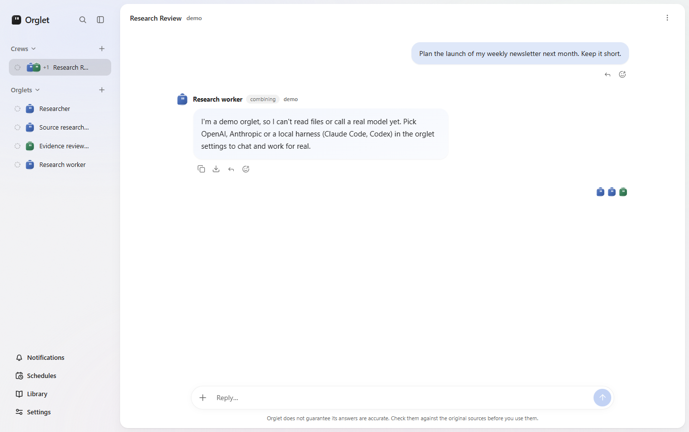
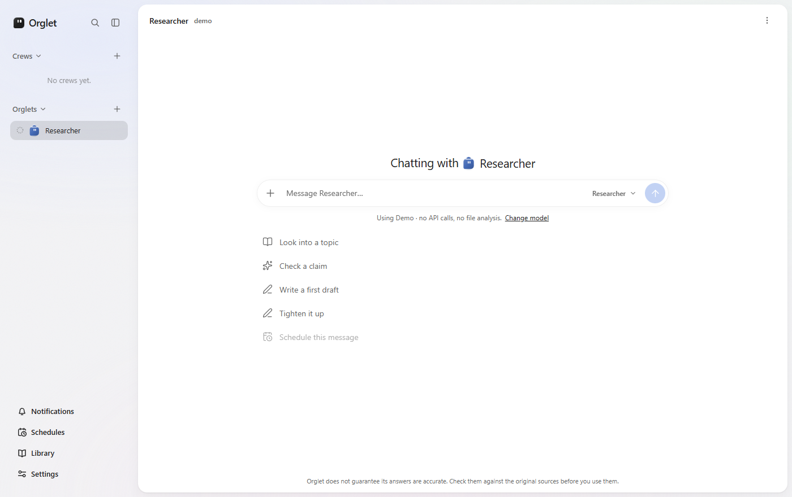

<div align="center">


# Orglet

**Your own small team of AI workers, on your computer.**

[](LICENSE)
[](https://github.com/codepawl/orglet/releases/latest)
[](docs/implementation_status.md)

<picture>
  <source media="(prefers-color-scheme: dark)" srcset="docs/images/chat-dark.png">
  
</picture>

</div>

## What

Orglet is a desktop app where you keep a few AI workers, each with a name, a role and their own instructions, and give them work in a normal chat.

- **Use the AI plan you already pay for.** Workers can run on the Claude Code or Codex account you are signed in to, so there is no extra API bill.
- **Keep your data on your computer.** No Orglet account, no Orglet server. Chats, workers and files live in a local database.
- **Made for one person.** Freelancers, solo founders and anyone who uses ChatGPT or Claude every day and wants a bit more structure.

Click a **team** or **worker** in the sidebar to open that chat. One live conversation each; a new message is a turn, not a new task. Team chats plan, run members as hidden jobs, and bring one report back. Internal jobs stay under **Details**. [How it works](docs/team-chat.md).

> Orglet is early. Expect rough edges, and check answers against your own sources before you rely on them.

| | |
|---|---|
| 💬 **Chat with a worker** | Click a worker. One live thread — a new message is a turn, not a new task. |
| 👥 **Chat with a team** | Click a team to open its chat. Members stay in the roster. One live thread per team. Type `@name` to tag who should take that turn. The lead plans, assigned members work, one report comes back. [How it works](docs/team-chat.md). |
| 📎 **Attach files safely** | A worker only reads the files you attach to that chat. |
| 📄 **Reports as documents** | Ask for a report and it opens like a file. Copy it as plain text or Markdown, or download it. |
| 🔁 **Repeat work on a schedule** | Schedules send the same request every day or week while Orglet is open. If the computer was off, missed runs become one catch-up you can run or skip; the next time stays on the calendar. |
| 📚 **Reuse what works** | Save skills and notes that workers use in later chats. |
| 🗂️ **Stay tidy** | Archive a chat to start over. Archive or delete workers and teams. Archived items can clear themselves after 7 or 30 days. |
| 🌐 **Your language** | US English by default, with UK English and Vietnamese in Settings. |

<p align="center">
  
</p>

Workers can run through a local CLI, an API key, or Demo:

| Option | What you need | Cost |
|---|---|---|
| Claude Code on this computer | Claude Code installed **and signed in** | Your Claude plan |
| Codex on this computer | Codex installed **and signed in** | Your ChatGPT plan |
| Cursor Agent on this computer | Cursor Agent CLI installed **and signed in** | Your Cursor plan |
| OpenAI, Anthropic, Grok (xAI) or OpenRouter API | An API key saved in Settings | Pay per use, with limits you set |
| Ollama on this computer | Ollama running locally | Local, no Orglet budget |
| Demo | Nothing | Free, sample replies only |

Each API or harness worker can use a model ID from **that provider's own list** (cached 24 hours in the local database) or a typed custom ID. Catalog names such as GPT-4.1 mini are suggestions, not a lock. If the list is empty or fails to load, you can still type an ID. When the cached list marks the selected (or suggested) model as deprecated, the picker shows a quiet chip; a sunset date appears only if that provider's API included one (OpenAI `shutdown_date`). Anthropic, xAI and harness lists have no native dates, so Orglet does not invent them. Details: [model-list-fetch.md](docs/model-list-fetch.md).

**Settings → Local harnesses** always shows Claude Code, Codex and Cursor Agent as **not installed**, **found on disk**, **signed in (ready)** or **sign-in error**. Found on disk is not ready to run. If sign-in fails, the screen gives the CLI login command to copy; Orglet does not switch to Demo.

API keys are encrypted with your system's secure storage and never reach the app's interface.

Orglet has no account and no server of its own. Requests go only to the provider or local tool you choose for a worker, using attached files and workspace folders you explicitly grant. If a worker submits a malformed report, Details shows the invalid field and Orglet allows one report-only correction without repeating completed file operations.

Start here: [Getting started](docs/getting-started.md). The [docs map](docs/README.md) lists how-it-works pages, product decisions, and ship records. Product fit is [product.md](docs/product.md). How to run and test is [technical-guide.md](docs/technical-guide.md).

[Agent tools and permissions](docs/agent-tools.md) explains task permissions, workspace grants and revocation. Open a chat's **Details → Tool permissions** to choose its working folder and access level. Core can edit that folder and run isolated checks through private copies and conflict checks. API workers and the CLI tool bridge dispatch through these handlers; native CLI permission enforcement still needs live verification. Git workspace roots use separate worktrees based on the current files, including uncommitted edits. Public web reads and search require a separate switch; search may be unavailable when its provider requires human verification.

Team progress shows who is doing each unfinished assignment, a short description, and who they are waiting for. Expand a long description to read the full assignment. **Details → Files and processes** keeps conflicts, saved output and unknown outcomes visible after a restart. After checking the current files, you can retire an interrupted attempt without retrying its effects or marking it successful.

API team leads can inspect a granted workspace read-only before assigning paths, record blocker resolutions, and reassign unfinished work within the turn's existing permissions. Reassignment retains dependencies and file ownership, with at most two attempts per assignment. A blocker report is saved for review but does not unlock dependent work; file assignments with no changes remain unfinished. Saved runs identify who actually completed a reassigned result.

A mistyped team-message recipient gets an error with the valid participants so the worker can correct it in the same run. Structured reports can cite completed workspace process IDs for command checks; unsupported checks stay unassessed instead of discarding completed files.
Workspace-only QA observations without a source citation remain visible as unverified limitations, and blocked QA work stays blocked for the lead to repair.

When a worker or team lead needs a material choice before continuing, it can pause the current chat turn with a short question. Choosing an option or answering in the composer resumes that same run; the decision stays visible in Details. Answering does not extend workspace or network permissions. A restored backup retains the question history but cannot resume its excluded checkpoint.

An API worker or team lead can also record how it understands the current turn: the goal, constraints stated by the user, assumptions it has made, and checks it plans to run. The latest goal appears in chat; the full record is in Details. Planned checks are intentions, not evidence that a check passed.

## Install

[Latest release](https://github.com/codepawl/orglet/releases/latest) is **v0.2.0**. The tag is public; Windows **Setup.exe** / **ZIP** assets on that release may still be empty. If they are missing, [build from source](#dev).

Windows installers are unsigned. macOS CI signs with Developer ID and notarizes with Apple, so a macOS build from CI opens without a Gatekeeper warning.

| Platform | Status |
|---|---|
| Windows | Public 0.2.x target. Unsigned ZIP and Squirrel Setup from `pnpm make`. If those files are not attached to the GitHub Release, build locally. SmartScreen may warn (unknown publisher); that is expected. See [windows-release-gates.md](docs/windows-release-gates.md). |
| macOS | ZIP of `Orglet.app` from `pnpm make` on a Mac, or the `orglet-macos-signed-zip` CI artifact. CI signs it with Developer ID and notarizes it with Apple, so it opens without the right-click workaround. Not a GitHub Release asset yet, and a local `pnpm make` stays unsigned. See [macos-packaging.md](docs/macos-packaging.md). |
| Linux | ZIP from `pnpm make` on Linux, or the `orglet-linux-zip` CI artifact. CI builds it and starts it headless on every pull request, but nobody has used it on a real Linux desktop yet, so treat it as untested. See [linux-packaging.md](docs/linux-packaging.md). |
| iOS and Android | Not started. The shape under discussion is a companion to a desktop workspace, not a port: a phone cannot run a worker. See [mobile.md](docs/mobile.md). |

## Dev

You need Windows, macOS or Linux, Node 24.19 or newer and pnpm 11.19.0.

```
pnpm install --frozen-lockfile
pnpm dev
```

The Researcher worker starts on **Demo**, so you can try the app without any account.

To run the checks and build a package under `out/make`:

```
pnpm typecheck
pnpm test
pnpm make
```

On Windows that writes a ZIP and Squirrel Setup (unsigned). On macOS it writes a ZIP of `Orglet.app`. Local macOS makes stay unsigned unless `APPLE_SIGNING_ENABLED=true` and a Developer ID identity is in the keychain; CI signs when secrets exist. Notarization is a separate Apple ID / API key step.

## Contributing

Issues and pull requests are welcome. Read [CONTRIBUTING.md](CONTRIBUTING.md) first. Coding agents should start at [AGENTS.md](AGENTS.md). Contributions need the [Contributor License Agreement](CLA.md), and everyone follows the [Code of Conduct](CODE_OF_CONDUCT.md). Report security problems privately as described in [SECURITY.md](SECURITY.md).

Questions and ideas go to [Discussions](https://github.com/codepawl/orglet/discussions).

## License

Orglet is free software under the [GNU Affero General Public License v3.0](LICENSE). You can use, study, change and share it. If you share Orglet, or let other people use a changed version over a network, you must also share the source under the same license.

For a commercial license without those terms, contact legal@codepawl.com.

Copyright (C) 2026 Nguyen Xuan An (CodePawl).

Tool access is checked by core against both the run's frozen permissions and the task's current permissions. Reducing permissions cancels active work; restored backups do not restore tool grants. See [tool permissions](docs/agent-tools.md).

Team assignments record an expected output, dependencies and editable resources. Independent work can run in parallel; overlapping resources are serialized, and a dependent worker waits for a committed prerequisite result.

The Windows workspace backend provides bounded file operations and isolated command processes in private copies. Public web tools require a separate task capability. The desktop controls and guarded integration of edited files are delivered separately; see [agent tools](docs/agent-tools.md).

Team workers can exchange durable questions, responses, blockers and handoffs within one turn. The lead resolves blockers or reassigns unfinished work to an existing member without expanding its permissions. See [team coordination](docs/agent-tools.md#team-coordination).

Workspace edits are integrated from private copies with version checks. Conflicts and interrupted writes remain visible and block automatic replay. Git workspaces use private worktrees; the original checkout is not used for worker commands. API workers and the three CLI adapters share the core tool dispatcher.
