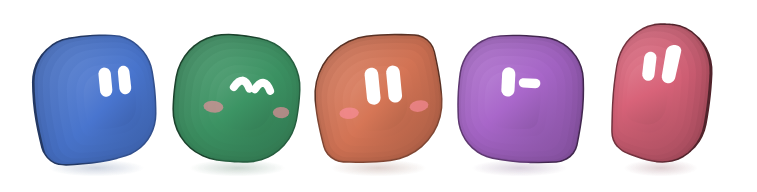

<div align="center">


# Orglet

**Your own small team of AI workers, on your computer.**

<picture>
  <source media="(prefers-color-scheme: dark)" srcset="docs/images/orglets/crew-dark.png">
  
</picture>

[](LICENSE)
[](https://github.com/codepawl/orglet/releases/latest)
[](docs/implementation_status.md)

<picture>
  <source media="(prefers-color-scheme: dark)" srcset="docs/images/chat-dark.png">
  
</picture>

</div>

## What Orglet is

Orglet is a desktop app where you keep a few AI workers, called **orglets**. Each orglet has a name, a role and its own instructions. You give them work in a normal chat, one to one or together in a **channel**.

Orglet is made for one person: freelancers, solo founders and anyone who uses ChatGPT or Claude every day and wants more structure.

- **Use the plan you already pay for.** Orglets run on your Claude Code, Codex, Cursor Agent or Gemini CLI account. There is no extra API bill.
- **Keep your data on your computer.** Chats, orglets and files live in a local database. No Orglet server holds your work.
- **No account needed.** A free CodePawl account is optional, and nothing syncs yet ([account](docs/account.md)).
- **Open source.** The code is here under AGPL-3.0.

> Orglet is early. Expect rough edges, and check answers against your own sources before you rely on them.

## What you can do

| | |
|---|---|
| **Chat with an orglet** | Click an orglet to open its chat. A new message is a turn in that chat, not a new task. [Chat guide](docs/chat-guide.md) |
| **Work together in a channel** | Put several orglets in one named chat. They take turns, or a lead splits the work and brings one report back. Type `@name` to pick who answers. [How it works](docs/team-chat.md) |
| **Group channels in a space** | A space holds the channels of one piece of work and the orglets that do it. Each channel takes all of them, or its own few. [How it works](docs/chat-guide.md#the-area-rail-and-the-sidebar) |
| **Give it files and a folder** | An orglet reads only the files you attach and the folder you grant. It edits a private copy, and you review the diff before your folder changes. [Tools and permissions](docs/agent-tools.md) |
| **View and edit files** | Open text, code, tables, images and PDFs in the app. Edit or mark them up, and save the result as a new version. [How](docs/viewing-and-editing-files.md) |
| **Repeat work on a schedule** | Send the same request every day, every week or every few hours while Orglet is open. [Schedules](docs/routines.md) |
| **Let it remember** | An orglet keeps short notes about how you like things done. You can correct, pin or delete each one. [Memory](docs/memory.md) |
| **Browse and use apps** | With your permission, an orglet reads web pages in its own browser, and on Windows it works in the desktop apps you allow. It asks before anything that sends, pays or deletes. [Browser](docs/browser.md), [desktop apps](docs/desktop.md) |
| **Connect other services** | Add MCP servers, and choose which orglet can use each one. [MCP servers](docs/mcp.md) |
| **Find ready-made orglets** | Add curated orglets, channels and spaces from the marketplace. Browsing and adding need no account. [Marketplace](docs/marketplace-design.md) |
| **Use the terminal** | The `orglet` command sends messages, reads answers and manages chats from a terminal or a script. [The orglet command](docs/cli.md) |
| **Search everything** | **Ctrl+K** searches every message and answer in every chat, on this computer only. [Search](docs/chat-guide.md#search) |

The interface is in US English by default, with UK English and Vietnamese in Settings.

## What an orglet runs on

| Option | What you need | Cost |
|---|---|---|
| Claude Code, Codex, Cursor Agent or Gemini CLI on this computer | The CLI installed and signed in | Your existing plan |
| OpenAI, Anthropic, Grok (xAI) or OpenRouter API | An API key saved in Settings | Pay per use, with limits you set |
| OpenCode Zen or OpenCode Go API | A Zen or Go API key saved in Settings | Your Zen balance or Go subscription |
| Ollama on this computer | Ollama running locally | Local |
| Any OpenAI-compatible server | A name, a base URL and, if the server needs one, an API key | Free on this computer or a private network, otherwise the price you enter |

API keys are encrypted with your system's secure storage. Requests go only to the provider or local tool you choose for an orglet. Details: [connections](docs/connections.md), [capabilities](docs/capabilities.md).

## Install

On Windows, with Node.js 20 or later:

```sh
npx @codepawlhq/orglet
```

The command downloads the latest Setup, checks its signature and runs it ([how](installer/npm/README.md)). You can also download **Setup.exe** or the ZIP from the [latest release](https://github.com/codepawl/orglet/releases/latest). An install from Setup updates itself.

| Platform | Status |
|---|---|
| Windows | The public release target. Setup and ZIP are signed. SmartScreen can still warn while the certificate builds its reputation. Check that the publisher is **Open Source Developer Xuan An Nguyen**. [Details](docs/windows-release-gates.md) |
| macOS | An Apple silicon ZIP is on the release. No Intel Mac download is available. [Details](docs/macos-packaging.md) |
| Linux | An x64 ZIP is on the release. Daily use on a real Linux desktop is not verified, so treat it as experimental. [Details](docs/linux-packaging.md) |
| iOS and Android | Not started. [The plan under discussion](docs/mobile.md) |

## Run from source

You need Windows, macOS or Linux, Node 24.19 or newer and pnpm 11.19.0.

```sh
pnpm install --frozen-lockfile
pnpm dev
```

The Researcher orglet starts with no model. **Connect a model** in its chat leads to one. The tests and the packaged smokes run on sample replies, which the app gives only when `ORGLET_DEMO_REPLIES=1`.

Run the checks and build a package under `out/make`:

```sh
pnpm typecheck
pnpm test
pnpm make
```

More on running, testing and packaging: [technical guide](docs/technical-guide.md).

## Learn more

- [User guide](docs/user-guide.md): one short page for each part of the app.
- [Getting started](docs/getting-started.md): the first walk-through, with screenshots.
- [Docs map](docs/README.md): every how-it-works page, product decision and ship record.
- [Product](docs/product.md): who Orglet is for, and what it does not do yet.
- [Troubleshooting](docs/troubleshooting.md): sign-in errors, SmartScreen and other common problems.

Questions and ideas go to [Discussions](https://github.com/codepawl/orglet/discussions).

## Contributing

Issues and pull requests are welcome.

1. Read [CONTRIBUTING.md](CONTRIBUTING.md). It covers setup, checks and the pull request flow.
2. If you use a coding agent, point it at [AGENTS.md](AGENTS.md).
3. Agree to the [Contributor License Agreement](CLA.md) in your first pull request.
4. Follow the [Code of Conduct](CODE_OF_CONDUCT.md).

Report security problems privately, as [SECURITY.md](SECURITY.md) describes.

## License

Orglet is free software under the [GNU Affero General Public License v3.0](LICENSE). You can use, study, change and share it. If you share Orglet, or let other people use a changed version over a network, you must also share the source under the same license.

For a commercial license without those terms, contact legal@codepawl.com.

Copyright (C) 2026 Nguyen Xuan An (CodePawl).
