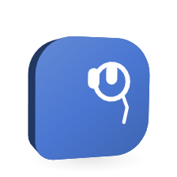

# Orglet's browser

<picture>
  <source media="(prefers-color-scheme: dark)" srcset="images/orglets/browser-dark.png">
  
</picture>

An orglet can open and read web pages in a real Chrome or Edge that Orglet starts for it. The browser runs without a window, so it never covers your work or takes your typing; you watch it inside Orglet, with the orglet's cursor moving from step to step, and take it over there. It uses a profile of Orglet's own, never your everyday browser profile. At the first level the orglet only reads: it opens a page, reads it as text, looks for something on it, scrolls it and keeps a screenshot for you. At the second level, **Read and act**, it can also click, type, choose from lists and press keys. Anything that could send, pay, buy or delete stops and asks you first, every time.

Use it when [reading a web page](agent-tools.md#public-web-tools) is not enough: a page that only shows its content after its scripts run, a long page you want searched, a site you signed in to yourself, a search box or a filter you want used, or an app running on your own computer at `localhost`.

Part of the [user guide](user-guide.md). The other permissions are in [agent-tools.md](agent-tools.md).

## Turn it on

1. Open the chat's **Details** and find **Tool permissions**, or open the orglet's settings and its **Permissions** tab.
2. Set **Browser** to **Read pages**, or to **Read and act** to let the orglet use pages as well.

**Browser** is off in every chat until you turn it on, including chats you had before this version. **Read and act** is never on unless you choose it. Demo orglets do not use tools, so the control is disabled for them with one line saying why.

With the browser on, the chat's **Details** also shows **Browser profile** and **Sites** under the MCP permissions.

## Profiles

A profile is what the browser remembers: cookies, sign-ins and site data.

- **Clean** is the default. Each run opens a private window that is signed in nowhere, and everything it stored is thrown away when the run ends.
- A **named profile** is one you make and sign in to yourself. Open **Settings → Browser**, choose **Add profile** and give it a name, for example `Work`. Then choose **Open to sign in**: a normal browser window opens, and you sign in to the sites you want orglets to read. Close the window when you are done. In a chat's **Details**, pick the profile under **Browser profile**.

  While a run is using a named profile, **Open to sign in** says so and waits, because the run's browser has the profile open. Use **Open in Chrome** in that chat instead, or wait for the run to end. If you already have the profile open to sign in when a run starts, the run uses that window.

Each named profile has a menu with **Close window**, **Clear data** (removes every sign-in, cookie and site's data in it, and keeps the profile) and **Delete profile**. A profile a run is using cannot be closed, cleared or deleted until the run ends.

A chat with a named profile opens only the sites on its list of allowed sites. A signed-in profile can see your accounts, so a page must never be able to lead the orglet to one you did not name.

**Chrome or Edge.** Orglet uses Chrome when it is installed and Edge otherwise, and **Settings → Browser** shows which one it found. A new Edge profile signs in to Microsoft sites with your Windows account on its own (we checked this on Windows 11 with Edge 153). The **Clean** profile does not, on either browser, because it is a private window. If you want a named profile that is signed in only where you signed in yourself, install Chrome.

## Sites

Each chat has its own site list under **Details → Tool permissions → Sites**. Type an address, such as `example.com` or `localhost:3000`, choose **Allowed** or **Blocked**, and choose **Add**.

- On the **Clean** profile, public sites open, except blocked ones.
- A blocked site never opens, and neither do its subdomains. Blocking `example.com` also blocks `www.example.com`.
- A page on this computer or your local network (`localhost`, `127.0.0.1`, `192.168.x.x`, a `.local` name) opens only when that exact address, host and port, is allowed. Allowing `localhost:3000` does not open `localhost:8080`.
- On a **named profile**, only allowed sites open.
- Settings, extension and file pages (`chrome://`, `edge://`, `file://` and the like) never open, whatever the list says.

The rules apply to every step, not only to the address the orglet asked for. A redirect, a frame inside a page, an image, a script, a web socket: each connection is checked, and one the list does not allow is refused. A click that leads to a site the list refuses is stopped the same way. A shorter list takes effect at the orglet's next step.

A [side thread](team-chat.md#side-threads) uses its main chat's profile and site list and cannot change them. It is never wider than its main chat: a site is allowed only when both lists allow it, and what the main chat blocks is blocked there too. It has **Read and act** only while its main chat has it.

## What the orglet can do

At **Read pages**:

- Open a page, in a new tab or in one it already has open. A run has at most four tabs.
- Read the page. It gets the page's structure as text: headings, text, links, buttons and form fields with their labels. It is not a picture. A long page comes in parts of 20,000 characters.
- Look for something on the page, and get only the lines that match, with the headings they sit under.
- Scroll, for pages that load more as you scroll.
- Keep a screenshot of what the page shows, for you to look at. The orglet itself cannot see images in this version.
- List and close its own tabs. A run never sees another run's tabs or yours, and its tabs close when its turn ends.

At **Read and act**, also:

- Click a link, a button or a checkbox.
- Type into a field, replacing what is there, and press Enter after it if asked to.
- Choose from a list.
- Press one key: Enter, Tab, Escape, the arrow keys, Page Up, Page Down, Home, End or Backspace.
- Wait up to five seconds for a page that is still loading.

The orglet names each element by a mark from its latest reading of the page. If the page no longer has that element, or the element changed its name, the step is refused and the orglet reads the page again.

What a page says is untrusted, like a [web page](agent-tools.md#public-web-tools): instructions on it do not give the orglet any permission, words on a page can never make a step count as less serious, and an app change the orglet proposes after reading a page always waits for your click.

## When the orglet asks you

Orglet decides how serious each step is from what the page shows about the element and the page. The orglet has no say in it.

A step **asks you first** when it could:

- Send a form that sends data somewhere (a search box that only opens a results page does not count).
- Send what was typed, such as Enter in a message box.
- Open a file picker, or download a file.
- Do what its name says, when the name is like send, pay, buy, order, checkout, purchase, delete, remove, post, publish, confirm, subscribe, transfer, sign out or submit, or the Vietnamese gửi, thanh toán, mua, đặt hàng, xoá or xóa, đăng, xác nhận, chuyển tiền. So do the buttons a site often sends with a script instead of a form: reply, comment, share, repost, invite, approve, merge, deploy, accept, agree, book now, reserve, donate, revoke, deactivate, uninstall, and trả lời, bình luận, chia sẻ, mời, phê duyệt, đồng ý, chấp nhận, đặt chỗ, đặt phòng, đặt vé, đặt bàn, quyên góp, nạp tiền, rút tiền. Accents do not matter: "Thanh toan" counts, and so does "XÓA". A word written with other accents is another word, so "Mới nhất" is not "mời".
- Happen on a page that looks like a sign-in, a payment or a CAPTCHA page.

The card appears in the chat under the orglet's name: **Researcher wants to click “Place order” on shop.example.com**, with the text it would type, why Orglet asks, and a picture of the page with the element outlined. Choose **Allow once** or **Don't allow**. There is no "always": the next such step asks again. A declined step comes back to the orglet as declined, and it does not try it again in that turn. Nothing reaches the site until you allow it.

Only a chat with one orglet can ask, side threads included. In a crew, a group chat or a schedule, a step that would ask is refused, and the orglet tells you what is left for you to do.

**Stop** while a card is waiting cancels the step and the run; nothing is sent. A card nobody answers for 15 minutes counts as not allowed.

## Never, whoever asks

- Type into a password field or a card field.
- Type anything on a page with a CAPTCHA, or click the CAPTCHA itself.
- Answer a page's pop-up question (a JavaScript dialog). Orglet dismisses it and tells the orglet.
- Download a file, or choose a file to upload. A file picker the page opens is caught and left empty.

For these, the orglet asks you to take over.

## Watch it work

While a run is using the browser, the bar above the message box says where it is, **Researcher is on example.com…**, with **Watch**. **Watch** opens the live view over the chat: the page as the orglet sees it, updated as it changes. **Details → Browser** shows the same view, smaller, above the list of steps; **View larger** opens the big one.

The orglet's cursor is an arrow with its name. Before each click, choice or typing step it moves to the element, so you see where it is about to act: the middle of a button, a little way into a field it types in. A click leaves a small ring where it landed. Orglet draws the cursor over the picture itself; it is not part of the page, so a page cannot see it or fake it.

When the orglet asks you about a step, the card shows under the live view too, with the orglet's cursor already on the element it asks about.

The live view runs only while it is open. Closing it, or the run ending, stops the picture.

## Take over and hand back

**Take over** is in the live view and in **Details → Browser**. It holds the orglet's next browser step until you give the browser back. In the live view you then click, scroll and type on the page yourself: click once in the picture and your keys go to the page, Escape included, until you click elsewhere. Typing goes through your usual input method, and pasting pastes the text. Use it to sign in, answer a question on the page, get past a CAPTCHA, or show the orglet the way. While you hold it, a page may open a new window, such as a sign-in window; it opens as another tab, and the view follows it. The site rules still apply.

When you are done, choose **Hand back**, in the live view, in **Details** or on the bar. The step that was waiting goes on. A card that asks about a step waits for the hand-back too: while you hold the browser its **Allow once** and **Don't allow** are greyed out, with "You have the browser. Hand it back, then answer.", and in the chat the card has its own **Hand back**, since an allowed step would act on the page you are using. If the orglet's turn ended while you held the browser, its tabs stay open until you hand it back, then they close.

Holding the browser pauses only its steps. The orglet can still think and write, and a step that waits for more than 15 minutes comes back to it as "the person still has the browser", so it can answer with what it has.

## Open in Chrome

**Open in Chrome** moves the run's tabs into a real Chrome or Edge window you can use like any other, and takes the browser over if you had not already. The window opens at the same pages. For the **Clean** profile it carries the run's cookies and site data over, and brings them back when you hand back; what a page kept only in memory, such as a half-filled form, does not come along. A named profile opens in a window with everything it has stored.

While the tabs are in Chrome, the live view says so, with **Show Chrome window** and **Watch in Orglet**, which brings the tabs back into the live view while you keep holding the browser. **Hand back** brings them back and lets the orglet go on. Closing the Chrome window does the same as **Hand back**.

**Open in Chrome** is for what the live view cannot do. Orglet suggests it, in one quiet line under the live view with the reason, when:

- the page asks for a passkey,
- the page asks you to pick a file,
- the page asked a question in a dialog (Orglet closes those, since nothing in Orglet may answer them),
- you click into a password or card field while you hold the browser, so the browser's own autofill can help,
- the page asks you to sign in through the browser's own sign-in box.

It only suggests. Nothing moves to a window until you choose **Open in Chrome**.

Signing in happens only here: on the pages of a run you took over, in the live view or in Chrome, or in **Settings → Browser → Open to sign in**. The orglet never types a password.

## What you see

- While it works, the bar above the message box says where it is: **Researcher is on example.com…**, with **Watch**. While a card waits: **Researcher is waiting for your OK…**. While you hold the browser: **You have the browser**, with **Watch** and **Hand back**; with the tabs in Chrome, **You have the page in Chrome**.
- In the answer's steps: **Opened example.com**, **Read the page example.com**, **Searched the page**, **Took a screenshot of example.com**, **Typed into “Search” on example.com**, **Clicked “Search” on example.com**, **Asked to click “Place order” on shop.example.com · allowed** or **· declined**. A step the rules refused shows as a step that did not go through, with the reason.
- **Details → Browser** shows the live view while a run uses the browser, then lists the chat's browser steps, newest first, each with its site and time. An acting step names its element and says whether it was plain **input** or **asked first**, and whether you allowed it. A step with a screenshot, including the picture a card showed, has a button to view it.
- No browser window opens while the orglet works, so nothing takes the foreground or your typing, and nothing shows on the taskbar. A window opens only when you ask for one: **Open in Chrome**, or **Open to sign in** in Settings. That window shows the bar that says the browser is controlled by automated software.
- **Stop** stops a step in the middle, a page that is still loading included.

## Schedules and crews

A [schedule](routines.md) can read pages too. In the schedule's editor, under **Limits & permissions**, set **Browser** to **Read pages**, pick a profile and fill in its sites. Saving the schedule approves that profile and that list: change either and the schedule needs saving again before it runs. A schedule never acts on pages: nobody is there to answer a card, so **Read and act** is not offered and a schedule that carries it is not saved.

A crew's chat and a group chat have the same **Browser** control as any chat, and every member that runs in them may read pages under the chat's list. At **Read and act** they may type, click and choose, but a step that would ask you is refused.

## How it works

**Where each part runs.** The core decides every step before it happens: whether the chat has the browser on, whether the profile is the one the run started with, whether the address passes the site list, and for an acting step how serious it is. It records each step in a journal. A separate browser host process, started by the main process the first time a run needs it, drives Chrome or Edge through `playwright-core` over a pipe, never a debugging port. The main process keeps the named profiles, as folders under Orglet's data folder, and relays the core's steps to the host. The window only shows state: profile names and dates, never their folders.

**The two gates.** Every connection the browser makes goes through a small proxy inside the host process, including connections to this computer. The proxy looks each name up itself, refuses one that points into a private network unless the chat allows that exact address, and connects to the address it checked, so a name cannot switch to a local address between the check and the connection. It sees every hop of a redirect, which a hook on the page's requests does not. A second check on the page's requests refuses blocked sites and, on a named profile, pages and frames on sites that are not allowed. Before a page is read or pictured, the page's address and every frame's address are checked again, and after an acting step the address the page landed on is checked too.

**An acting step.** The host takes a fresh reading of the page and reports the element (its role and name, the kind of field, the form it belongs to and how that form sends, the link it sits in) and the page (a visible password or card field, a payment provider's frame or an address like `/checkout`, a CAPTCHA). The core sets the risk from those facts alone (`core/tools/browser-risk.ts`). A step that asks waits in the running turn: the card lives in the core's memory, the window shows it, and your click is a command only the window sends. Right before the step, the host checks the page is still at the same address and the element still has the same role and name; a page that swapped "Next" for "Place order" while you were asked gets read again instead of clicked.

**No window.** A run's browser is Chrome's own headless mode: the real browser, with no window. Pages see the same user agent that browser sends with a window, passed as the `--user-agent` switch so the header and the client hints (`Sec-CH-UA`, `navigator.userAgentData`) agree; a plain headless user agent says `HeadlessChrome`, and some sites refuse it. Nothing else is hidden: `navigator.webdriver` stays true and Orglet never turns off Chrome's automation signals. We measured this on Windows 11 with Chrome 153 across 23 sites, two visits each: with its own user agent, headless was blocked on 6 of 46 visits and met a challenge page on 14; with the headed user agent, 2 blocks and 12 challenges, the same as a window kept off screen. Unlike a minimized window, it never took the foreground: 0 ms over two rounds of opening tabs, clicking, typing and a popup, where a minimized window came to the front five times for 60 to 95 ms each. Chrome keeps only the last `--disable-features` switch it is given, so the one the host passes lists Playwright's disabled features as well as its own; otherwise HTTPS upgrades, Translate and paint holding would come back on.

**The live view.** While a view is open, the host streams the tab the run used last with Chrome's screencast (`Page.startScreencast`): JPEG pictures at quality 60, no wider than the view draws them, and at most ten a second, because the host acknowledges each picture only after 100 ms and Chrome sends the next one only then. A page that does not change sends none. Chrome can drop a frame that comes while earlier ones wait for that acknowledgement, which left the last change of a burst unsent in our tests, so 400 ms after the last frame the host sends one picture of the tab as it is. While Orglet takes a screenshot of its own for a card, which covers password fields and outlines the element for that moment, frames are held back. The pictures pass from the host through the main process to the window and are drawn on a canvas; they are never written anywhere, and the window gets nothing else from the page. A view renews its watch every 10 seconds, and the host stops streaming a watch that is not renewed within 30, so a window that reloaded does not leave a stream running.

**The cursor.** Before a click, a choice or typing, the host scrolls the element into view, reads its box, and tells the window where the orglet points, in the page's pixels. The host keeps the last point per run and tab, so a view opened between steps shows it at once. A card that asks about a step puts the cursor on its element when its picture is taken. While someone watches, the step waits 300 ms for the drawn cursor to arrive before it acts; with nobody watching it does not wait. In our scenario a click took about 0.65 s and typing about 0.6 s with the live view open, against about 0.35 s and 0.29 s with it closed.

**Your input.** In the live view, a point is turned into the page's pixels from the size the view is drawn at and the size of the page the pictures report, so the window's display scaling does not matter. Clicks, the wheel and keys go to the tab through the main process and the host, which sends them as Chrome input events with Playwright's mouse and keyboard, one at a time and in order. The host takes them only while you hold the browser. Characters come from a hidden text field, so an input method composes them first, and are entered as text.

**Open in Chrome.** A named profile's folder is locked by the browser using it, so the host closes the headless browser and opens the same profile with a window, at the tabs' addresses. A Clean run gets a private window of its own, with the cookies and site data of its headless context; handing back copies them into a new headless context the same way. A tab closed in the window is forgotten; the window closing (all of the run's tabs at once) counts as handing back, and the run goes on headless at the addresses its tabs were at. **Open to sign in** needs the profile's folder too, so it is refused while a run uses that profile headless.

**Suggestions.** The host notes a passkey request (a small script in each headless page calls Orglet before `navigator.credentials.get` or `create` asks for a passkey, and otherwise leaves the call as it was), a file picker it caught, a dialog it dismissed, a page that failed on the browser's own sign-in box (`ERR_INVALID_AUTH_CREDENTIALS`, or a 401 or 407 asking for one), and, after each click or key while you hold the browser, whether the page's focus is in a password or card field. The same suggestion is not repeated within 10 seconds, and handing back clears it.

**Holding the browser.** **Take over** is a command to the core. It marks the chat's browser as held and tells the host, which keeps popups open as the run's tabs and takes your input from the live view; with **Open in Chrome** it also moves the tabs into a window, where file pickers and dialogs are yours. Every browser step of the chat's runs checks the mark before it starts and waits while it is set. **Hand back** first brings tabs in Chrome back to the headless browser, then clears the mark, and the waiting step goes on. The mark lives in memory, so quitting the app clears it along with the run.

**What is kept.** Each step is a journal row: the run, the step, the tab, what kind of step, the site, the element for an acting step, the risk the core set (read, input or consequential), what came of it (done, refused, failed, declined or unknown) and the screenshot, if any. Screenshots, including the pictures cards show, are PNG files kept in Orglet's database on this computer, at most ten per run. Both go when you delete the chat, and neither goes into a [backup](settings.md#backup-and-restore). The live view's pictures and the cursor's position are never kept at all. A backup carries no browser profile and no site list; after a restore, turn the browser on again and pick the profile.

**Unknown outcomes.** A reading step that was running when the app closed simply runs again when the run continues. An acting step goes through the same tool journal as file edits: an input step may run again, but a step that asked you and was running when the app closed is never run again on its own; its outcome stays unknown for you to check. A card that was still waiting when the app closed counts as declined, since nothing was done.

**Network.** The browser has network, the way an [MCP server](mcp.md) you add does. Commands in a working folder still have none, not even loopback, and turning the browser on does not change that.

**Cost.** Each model step sends the conversation again. A page's text can be long (a pricing page read at about 50,000 characters in our tests), so only the latest page stays whole in later steps and older ones keep their first 1,500 characters. Looking something up on a page returns only the matching lines, and an acting step returns only the lines that changed.

## What it never does

- Use or attach to your everyday browser profile.
- Act on a page at **Read pages**, or in a schedule.
- Take a step that could send, pay, buy, order, delete, post or sign out without asking you first, or ask in a way that lets you say "always".
- Type a password or a card number, touch a CAPTCHA, answer a dialog, download, or upload a file.
- Hide that the browser is automated.
- Open a browser window you did not ask for.
- Open settings, extension or file pages, or a page on this computer or your network you did not allow.
- Sign in for you. You sign in yourself, after **Take over**, in **Open in Chrome** or in **Open to sign in**.
- Send anything to Orglet or anyone else. `playwright-core` sends no usage data; Chrome and Edge follow their own settings.

## Limits

| Limit | Value |
|---|---|
| Tabs per run | 4 |
| Screenshots per run, card pictures included | 10 |
| Snapshot part | 20,000 characters |
| Lines that changed, returned after an acting step | 3,000 characters |
| Text typed in one step | 2,000 characters |
| One wait | 5 seconds |
| Opening a page | 30 seconds |
| Waiting for your answer, or for the browser back | 15 minutes |
| Model steps in a run that may act | 24 |
| Sites per chat | 100 |
| Named profiles | 20 |
| Browser left open after the last run | 1 minute |
| Live view pictures | 10 a second at most, JPEG quality 60 |
| Live view without a renewal | 30 seconds |
