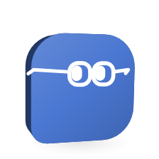

# Capability catalog

<picture>
  <source media="(prefers-color-scheme: dark)" srcset="images/orglets/capabilities-dark.png">
  
</picture>

## What a worker can do

Worker setup previews actions in plain language. Chat Details shows each worker's current connection, attachment, task-capability and workspace-grant status for the next turn. The execution layer still checks both the frozen run snapshot and current task policy; a newly enabled capability does not upgrade a resumed run, while revocation blocks it. A folder grant is a separate task-scoped permission. Imported sources remain read-only, and skill packages or knowledge are instructions, never grants. Team roles and routines decide who works and when, not what tools can bypass policy.

| Action | API workers | Claude Code / Codex / Cursor / Gemini CLI | OpenCode |
|---|---|---|---|
| Read attached source; inspect selected data | Core tool, subject to task capability and attachment; dataset checks are separate | Core tool loop supports both when enabled; source-only review uses a restricted copy/prompt; CLI fixtures cover the bridge | Not integrated; no support claim |
| Read, edit, run checks in a folder | Task folder grant with read/write/execute modes; isolated copy and core integration | Same core tools and grant; CLI native controls differ, so fixture parity is not proof of every installed version | Not integrated |
| Read/search public web | Separate task capability; bounded, untrusted results | Same core web tool in structured loop, never a native browser permission | Not integrated |
| Skill resource / knowledge | Reviewed text; no permission or script execution | Same rule | Not integrated |

Connection readiness comes from stored API/Ollama settings or a detected signed-in CLI. The view says Demo is unavailable for these actions. A missing source or grant is reported as setup needed, not as a model limitation. For teams the view does not merge unlike members into a misleading single “ready” badge. Live CLI evidence and unverified native controls remain identified below.

| Path | Enabled | Limits |
|---|---|---|
| Demo | Yes | Deterministic sample report; no model or source analysis |
| OpenAI native | Implemented; live acceptance pending | Default suggestion `gpt-4.1-mini-2025-04-14`; worker may pick or type any ID. Verified mini prices only for that catalog ID. Permission-checked core tools and validated output |
| Anthropic native | Implemented; live acceptance pending | Default suggestion `claude-haiku-4-5-20251001`; worker may pick or type any ID. Verified Haiku prices only for that catalog ID. Provider-scoped consent, trusted tools |
| Grok (xAI) native | Implemented; live acceptance pending | OpenAI-compatible Chat Completions at `https://api.x.ai/v1`, default suggestion `grok-3-mini`, worker may pick or type any ID; native list tenths used when cached. Same trusted tools and report gate |
| OpenRouter native | Implemented; live acceptance pending | OpenAI-compatible Chat Completions at `https://openrouter.ai/api/v1`, default suggestion `openai/gpt-4.1-mini`, worker may pick or type any ID; native list tenths used when cached. Same trusted tools and report gate |
| OpenCode Zen native | Implemented ([COD-112](https://linear.app/codepawl/issue/COD-112)); fixtures only, live acceptance pending (no key) | Own Zen key, OpenAI-compatible Chat Completions at `https://opencode.ai/zen/v1`. No default model and no pinned price. Charged to the Zen balance per request and bounded by the Zen console's spending limit; no Orglet budget reservation and no per-task budget field. Only IDs the Zen docs list on `/chat/completions` run; Responses, Messages, Gemini and System One models report *Not supported*. Same trusted tools and report gate |
| OpenCode Go native | Implemented ([COD-112](https://linear.app/codepawl/issue/COD-112)); fixtures only, live acceptance pending (no key) | Own Go key, OpenAI-compatible Chat Completions at `https://opencode.ai/zen/go/v1`. Billed and limited by the Go subscription (5-hour, weekly, monthly); no Orglet budget reservation. Only IDs the Go docs list on `/chat/completions` run (MiniMax and Qwen are Messages in Go and report *Not supported*). Same trusted tools and report gate |
| Local Ollama | Implemented | OpenAI-compatible Chat Completions at `http://127.0.0.1:11434/v1`. Toggle in Settings (no API key). Default suggestion `llama3.2`. No Orglet budget reservation. Same trusted tools and report gate |
| Teams | Yes | Up to eight members, concurrency two for independent assignments, resource ownership, dependencies, mailbox, lead reassignment and synthesis |
| Team chat + orchestrator | Yes ([COD-24](https://linear.app/codepawl/issue/COD-24) shell, [COD-25](https://linear.app/codepawl/issue/COD-25) plan→members→report, [COD-26](https://linear.app/codepawl/issue/COD-26) hide task pile; [team-chat.md](team-chat.md)) | Click worker or team → one live `tasks` row; later messages `reviseTask`; sidebar is workers/teams not a task list; synthesizer plans, assigned members run as hidden jobs, one synthesis in the transcript; fail-closed `partial` / named errors; Chi tiết keeps cost/retry/cancel |
| Provider request concurrency | Yes | Workspace-wide per provider, 1–8 (default 2); queued steps hold no budget reservation |
| Local dataset checker | Yes | CSV/JSONL/Parquet; schema, counts, ID checks, column-name/row-count/ID-set comparison for two files; fixed SQL, process deadline, retained provenance |
| Reviewed knowledge | Yes | Workspace/team/worker scope, immutable revisions, FTS5 keyword search, pins; model proposals and template imports wait for review |
| Context compiler | Yes | Platform → team → worker → skill → approved knowledge; duplicate removal, 12 items / 16 KB knowledge budget, frozen per-run manifest |
| Folder intake | Yes | 20 files, 64 MB total, 8 levels, 1,000 entries; excluded-item list |
| Local Claude Code harness | Yes, when installed and signed in; live review verified | Headless `-p` with restricted/safe mode; structured core-tool loop, or Read/Grep/Glob for source-only review; no Orglet reservation |
| Local Codex harness (`codex exec`) | Yes, when installed and signed in; live review verified | Structured core-tool loop; native shell, web, image, apps, browser and computer tools disabled; user config and project instructions excluded |
| Local Cursor Agent harness | Yes, when installed and signed in; live probe optional | Headless `agent -p --mode=ask --sandbox enabled --trust`; report schema embedded in the prompt; never `--force`/`--yolo`; no Orglet reservation |
| Local Gemini CLI harness | Yes, when installed and signed in ([COD-243](https://linear.app/codepawl/issue/COD-243)); fixtures only, no live run | Headless `--output-format stream-json`, prompt on stdin; no native tools (`tools.core: []` in a workspace settings file in the private folder), no extensions, MCP servers, skills, hooks or `GEMINI.md`; sources inlined; every `@` escaped; never `--yolo`; no Orglet reservation. See [Gemini CLI lockdown](technical-guide.md#gemini-cli-lockdown) |
| Codex app-server | No | `codex exec` covers review runs; app-server is not used. See below |
| Model list fetch + cache | Yes ([COD-31](https://linear.app/codepawl/issue/COD-31)) | Native OpenAI/Anthropic/xAI/OpenRouter/OpenCode Zen/OpenCode Go HTTP, Ollama `/api/tags`, Codex/Cursor CLI, Claude Code and Gemini CLI aliases; SQLite `settings.modelLists`, 24h TTL, stale-while-revalidate; fail-open custom ID; no HTML scrape. See [model-list-fetch.md](model-list-fetch.md) |
| Worker model picker | Yes ([COD-28](https://linear.app/codepawl/issue/COD-28)) | Per-worker list + typed custom ID; catalog defaults are suggestions; adapters/harness `--model`/`-m` use the saved ID |
| Deprecated model chip | Yes ([COD-30](https://linear.app/codepawl/issue/COD-30)) | Quiet chip on selected/suggested ID when cached `deprecated` is true; sunset day only from native `sunsetAt` (OpenAI `shutdown_date`); no HTML scrape or invented dates |
| Subscription quota display / internal allocation | No | Neither CLI exposes quota windows in headless mode; no screen is shown |
| Workspace files and commands | Explicit grant, Windows x64 isolation backend | Private copies or Git worktrees; hash-checked integration; Node/cmd commands without network; recovery in Details. See [agent tools](agent-tools.md) |
| Public web reads and search | Explicit task capability | Public-address validation, bounded text and provenance; provider challenges fail visibly |
| Imported skill scripts and external writes | No | No automatic skill-script execution or tool for changing another service |

## Local harness capability matrix

The table below describes the original source-only review path. Workspace, team, dataset-tool and web-enabled runs now use a structured tool-selection loop: core validates and executes each requested tool. Claude Code receives an empty native tool list in this loop; Codex retains the disabled native tools below; Cursor receives project deny rules for native file, shell, web and MCP tools in a fresh call directory; Gemini CLI has no native tools on either path. An orglet with an MCP server picked also takes this loop; the MCP call is executed by core with the chat's MCP permissions ([mcp.md](mcp.md)), never by the CLI's own MCP, which stays disabled as in the table below. These new paths have per-harness fixtures and native workspace tests. The historical live reviews below do not prove the new loop, Cursor's native permission enforcement or Gemini CLI's lockdown.

Decision (user, 2026-09-16): connect the agent harnesses already installed on the machine first, detected per machine so it works for other users too. The native OpenAI and Anthropic paths do not depend on them.

| Capability Orglet needs | Claude Code 2.1.x | Codex CLI 0.154 | Cursor Agent CLI | Gemini CLI 0.61 |
|---|---|---|---|---|
| Read only the selected sources | Copies in a temp folder; `--restricted` confines file tools to it | Text inlined in the prompt; no file access (its shell-based reads are rejected by the Windows read-only sandbox, and shell tools are disabled) | Copies in a temp folder; `--workspace` points at the copy; ask mode | Text inlined in the prompt; no file tools at all; every `@` escaped so the CLI attaches no file |
| No shell, network, MCP, user plugins | `--restricted --safe-mode --strict-mcp-config --tools Read,Grep,Glob` | `--sandbox read-only --ignore-user-config`, `shell_tool`, `unified_exec`, apps, browser and computer use disabled | `--mode=ask --sandbox enabled`; never `--force`/`--yolo`; MCP not auto-approved | Workspace `.gemini/settings.json` in the private folder: `tools.core: []`, skills and hooks off, no `GEMINI.md`; `--extensions none`; `--allowed-mcp-server-names` with an unused name; `GEMINI_CLI_TRUST_WORKSPACE` so the file loads; never `--yolo`; a `tool_use` event stops the run |
| Structured report | `--json-schema`, validated again by core | `--output-schema`, last message validated again by core | Schema embedded in the prompt; `--output-format json`; validated again by core | Schema embedded in the prompt; `--output-format stream-json`, answer text validated again by core |
| Auth state | `claude auth status` JSON | `codex login status` text; an expired token only shows at run time | `agent status --format json` (text fallback) | No status command: the method in its `settings.json` or environment, plus a cached Google token; exit code 41 at run time |
| Sign-in command | `claude auth login` (detected path) | `codex login` (detected path) | `agent login` (detected path) | `gemini` (detected path), then **Sign in with Google** |
| Cost and quota | `total_cost_usd` reported, shown in activity; `--max-budget-usd` = remaining task budget when the orglet (or its crew, group chat or schedule) has a limit, left out otherwise | Not reported | Not reported | Token counts reported and shown; no price; quota errors mark the plan limit |
| Cancellation | Process tree killed | Process tree killed | Process tree killed | Process tree killed; `GEMINI_CLI_NO_RELAUNCH` keeps it one process |

**Settings → Local harnesses** always lists Claude Code, Codex, Cursor Agent and Gemini CLI with four states: **not installed**, **found on disk (detected, not signed in)**, **signed in (ready to run)**, and **sign-in error** when the status probe fails. Detected-on-disk is never treated as ready. A failed harness login does not fall back to Demo. Repair steps are the CLI's own login command with the detected executable path (PowerShell `& "path" …` on Windows). Cursor also shows the documented install one-liner, and Gemini CLI its npm install line. There is no invented login URL; each CLI opens its own browser flow.

Verified locally: detection on this Windows machine (both found), argument contract, output parsing of real failure shapes, a `.cmd` shim round trip, runner validation and cancellation with an injected executor, packaged UI smoke. Live acceptance 2026-09-16: a Codex review through `CoreService` with real detection and execution completed. It found the contradiction in a three-line note, cited line 3 (re-validated by core), recommended `revision_required` and made no Orglet reservation. The first live attempt failed Orglet's gate because the model recommended ready with no checks; the report rules are now included in the harness prompt and the tool description. A Claude Code review (2.1.270, claude.ai Max login) through the same path also completed: it read the copied source with its restricted Read tool, cited line 3, recommended `revision_required`, reported an estimated $0.1191 against its plan, and made no Orglet reservation. The desktop-bundled CLI is not on PATH, so the login hint now shows the detected executable's full path.

## Pinned technical choices

- Electron 44.3.0, Forge 7.11.2, Vite 8.3.0, React 19.3.0; exact transitive resolution in `pnpm-lock.yaml`.
- Native desktop smoke reports the actual bundled SQLite engine, independently of the host Node engine. Startup rejects SQLite older than 3.51.3.
- OpenAI SDK 7.15.0. Default suggestion `gpt-4.1-mini-2025-04-14`, standard text input $0.40 and output $1.60 per million tokens for that catalog ID only. Cached input is deliberately estimated at the ordinary rate. No server tools with additional fees are enabled. Other IDs may be typed; they are not billed at mini rates.
- xAI via the same OpenAI SDK with `baseURL` `https://api.x.ai/v1`. Default suggestion `grok-3-mini` at $0.30 input / $0.50 output per million tokens (`pricingVersion` `grok-3-mini:0.30:0.50`). Cached native tenths apply to other listed IDs. Revalidate against [xAI pricing](https://docs.x.ai/developers/pricing) before release.
- The request upper bound uses serialized context/tool UTF-8 bytes plus framing allowance and the output cap. Reservation and settlement use integer micro-USD. Unknown requests keep their reservation across restarts and month boundaries.
- Forge's rebuild dependency references Electron node-gyp by Git URL; `pnpm-workspace.yaml` overrides it with the registry release `10.2.0-electron.2`. Exotic-subdependency blocking remains enabled.
- Forge needs hoisted node_modules. Lifecycle builds are explicitly allowed only for Electron, esbuild and electron-winstaller.
- DuckDB Node Neo 1.5.5-r.5, native engine 1.5.5. Packager explicitly includes its API, bindings, Windows x64 addon and detect-libc; native binaries are unpacked from ASAR. A packaged smoke verifies execution, not just file presence.

## Primary references

- [Electron releases](https://releases.electronjs.org/)
- [Electron security](https://www.electronjs.org/docs/latest/tutorial/security)
- [Electron utility process](https://www.electronjs.org/docs/latest/api/utility-process)
- [Electron safeStorage](https://www.electronjs.org/docs/latest/api/safe-storage)
- [SQLite WAL and the reset fix](https://sqlite.org/wal.html)
- [Node SQLite API](https://nodejs.org/api/sqlite.html)
- [OpenAI GPT-4.1 mini pricing and snapshot](https://developers.openai.com/api/docs/models/gpt-4.1-mini)
- [Anthropic model overview](https://platform.claude.com/docs/en/models/overview)
- [OpenAI list models](https://developers.openai.com/api/reference/resources/models/methods/list) (`shutdown_date` on the model object)
- [Anthropic list models](https://platform.claude.com/docs/en/api/http/models/list.md) (no deprecation fields)
- [xAI language-models](https://docs.x.ai/developers/rest-api-reference/inference/models) (native prices; no sunset field)
- [Codex `debug models`](https://developers.openai.com/codex/cli/reference.md)
- [Cursor Agent `--list-models`](https://cursor.com/docs/cli/reference/parameters.md)
- [Gemini CLI headless mode](https://github.com/google-gemini/gemini-cli/blob/main/docs/cli/headless.md), [configuration](https://github.com/google-gemini/gemini-cli/blob/main/docs/reference/configuration.md) and [trusted folders](https://github.com/google-gemini/gemini-cli/blob/main/docs/cli/trusted-folders.md) (read from the 0.61.0 npm package)
- [Model list fetch plan](model-list-fetch.md)
- [DuckDB Node Neo](https://duckdb.org/docs/current/clients/node_neo/overview)
- [DuckDB security configuration](https://duckdb.org/docs/current/operations_manual/securing_duckdb/overview)

Revalidate prices and supported model snapshots before a release. Registry versions and local tests alone do not establish provider compatibility.
