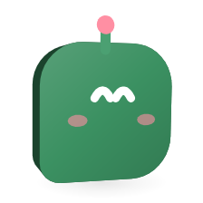

# The orglet command

<picture>
  <source media="(prefers-color-scheme: dark)" srcset="images/orglets/cli-dark.png">
  
</picture>

`orglet` lets you talk to your orglets and crews from a terminal. It is a companion to the running app, like VS Code's `code` command, not a separate agent. Keys, chats, files and the sandbox stay in the app. The command only sends requests to it.

## What it can do

| Command | What it does |
|---|---|
| `orglet status` | Says whether the app is running, its version, and how many orglets and crews it has |
| `orglet list` | Lists orglets with their provider and model, and crews with their lead and members |
| `orglet send "message" --to <name>` | Sends a message into that chat and prints the answer |
| `orglet read --to <name>` | Prints the latest answer in that chat |
| `orglet open [--to <name>]` | Brings the Orglet window forward, and with `--to` opens that chat |

It cannot grant a folder, touch API keys or connections, change settings or permissions, back up, archive or delete anything. Those stay in the window, where you can see what you are agreeing to. The app refuses any other request, even one that carries the right token.

## Install

### Windows

1. Install Orglet with Setup.exe.
2. Open a new terminal and run `orglet status`.

Setup writes a small `orglet.cmd` into `%LOCALAPPDATA%\Orglet\bin` and adds that folder to your own user PATH (not the system one), the way VS Code's installer does. Each update and every start of the app rewrite that file, so the command keeps working after an update. A terminal that was already open does not see the new PATH; open a new one.

**Settings → About → Remove from PATH** deletes the file and the PATH entry, and later updates leave it off. **Add to PATH** there puts it back. Uninstalling Orglet removes both the file and the PATH entry.

Unpacked the ZIP instead of running Setup? Nothing is added by itself: click **Add to PATH** in **Settings → About**.

### macOS

The **About** tab shows a line like the one below. Add it to your shell's startup file, such as `~/.zprofile`, then open a new terminal:

```sh
export PATH="$PATH:/Applications/Orglet.app/Contents/Resources/bin"
```

### From source

Run `pnpm dev`, then in another terminal from the repository:

```sh
pnpm orglet status
pnpm orglet send "hello" --to Researcher
```

This uses the script `pnpm dev` builds into `.vite/build/orglet-cli.cjs`. It cannot start the app for you; start `pnpm dev` first.

## Commands

### send

```sh
orglet send "Summarise these notes" --to Researcher --file notes.txt
```

The message goes into the orglet's or crew's chat exactly as if you had typed it in the message box. If the chat already has a conversation, the message is the next turn in it; if not, it starts one. A crew's chat is led by its lead, as in the app.

By default the command waits for the turn to finish and prints the answer. A crew prints each member's reply and then the lead's, each under its name.

| Option | Meaning |
|---|---|
| `--to <name>` | The orglet or crew. Required. |
| `--file <path>` | Attach a file. Repeat it for more, up to 20. The same size and type limits as the file picker apply. |
| `--no-wait` | Return right after sending. Read the answer later with `orglet read`. |
| `--timeout <seconds>` | How long to wait. The default is 600. When it runs out, the turn keeps running in the app. |
| `--json` | Print the result as JSON |

Sending gives the same consent the message box gives: the message and attached files go to the providers of the orglets that run. The cost limit is the chat's own, or the orglet's or crew's default for a new chat.

### read

```sh
orglet read --to Researcher
```

Prints the answers of the latest message in that chat that has any. If the orglet is working on a newer message, the command says so. Reading a chat marks its answer as read, like opening it in the app.

### open

```sh
orglet open --to "Review crew"
```

Brings the window forward and opens that chat. On Windows the taskbar button may flash instead, because Windows does not always let another program take the front.

### Names

Names match without regard to case. A unique start of a name is enough: `--to res` finds Researcher. If the start fits several names, or nothing fits, the command lists the names you can use. If an orglet and a crew share a name, rename one in the app.

### JSON and exit codes

`--json` prints the result as JSON on standard output, including errors (`{"ok": false, "code": "not_found", "error": "…"}`).

| Exit code | Meaning |
|---|---|
| 0 | It worked |
| 1 | It failed: an unknown name, a turn that failed or ran out of time, a chat with no answer yet |
| 2 | The command was typed wrong. Run `orglet --help` or `orglet <command> --help`. |
| 3 | The app could not be reached, even after trying to start it |

Messages that come from the app are in the app's language.

## How it works

- While Orglet runs, it listens on a named pipe on Windows (`\\.\pipe\orglet-cli-` plus a hash of the data folder) or a socket file `cli.sock` in the data folder on macOS and Linux. Nothing listens on the network.
- Each start writes a new random token to `cli-token` in the data folder, readable only by you where the system supports it. Every request must carry it; the app compares it in constant time. Anyone who cannot read your data folder cannot use the pipe.
- A request is one line of JSON and the answer is one line back. The app checks each request against a fixed list of five operations and refuses everything else, lines over 1 MB, and more than eight commands at once.
- `send` goes through the same steps as the message box: attached files are imported by the app, then the chat's live conversation takes the message or a new one starts. The app then checks the chat until the turn stops.
- If nothing answers, the command starts Orglet on the same data folder and tries again for up to 30 seconds.
- The command finds the data folder from `ORGLET_USER_DATA`, then `ORGLET_DATA_DIR` (what a source run uses), then the usual place for the app. The Windows shim sets `ORGLET_USER_DATA` for you.
- The command itself is the app's own executable running a small script (`resources/orglet-cli.cjs`) as Node, the same way VS Code ships `code`. It needs no separate Node install.

The automatic checks run every command against a packaged build, including a wrong token and a request outside the list. They do not click **Add to PATH**, because that changes the user PATH of the machine running them.
