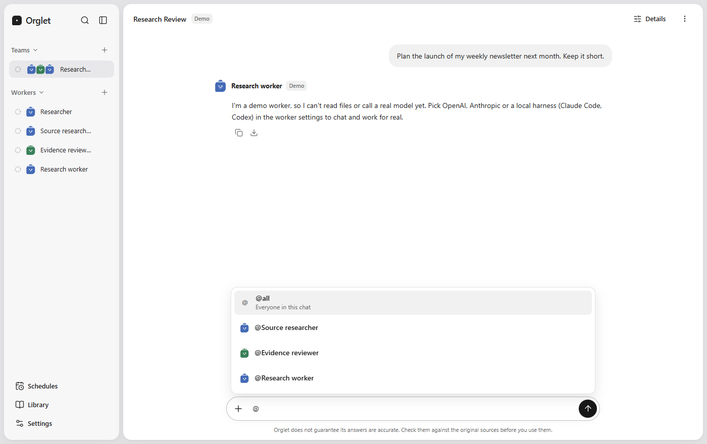

# Getting started

Orglet is a desktop app. You keep a few AI workers, each with a name and a role, and you talk to them in a normal chat. There is no Orglet account and no Orglet server. Chats, workers and files stay on this computer.

This page is the first walk-through. The [docs map](README.md) lists everything else. How teams work in detail: [team-chat.md](team-chat.md). How to run tests and connect providers in depth: [technical-guide.md](technical-guide.md).

Orglet is early. Expect rough edges, and check answers against your own sources before you rely on them.

## 1. Get the app

You need **Windows** or **macOS**. Linux is later. You do not need an Orglet login.

### From a GitHub Release

The [latest release](https://github.com/codepawl/orglet/releases/latest) is **v0.2.0**. Windows **Setup.exe** / **ZIP** on that release may still be empty. If they are missing, [run from source](#from-source) instead.

| If you use | Do this |
|---|---|
| Windows | Run Setup. SmartScreen may warn (unknown publisher). That is expected on unsigned 0.2.x: **More info** → **Run anyway**. Details: [windows-release-gates.md](windows-release-gates.md). |
| macOS | Unzip `Orglet.app`. It is not a GitHub Release asset yet; use a CI ZIP or a local make. Gatekeeper will warn until notarization exists: right-click → **Open**. Details: [macos-packaging.md](macos-packaging.md). |

### From source

You need Node **24.19** or newer and pnpm **11.19.0**.

```bash
pnpm install --frozen-lockfile
pnpm dev
```

The Researcher worker starts on **Demo**, so you can try the app without any account.

## 2. First look

On first launch the window is US English. A **Researcher** worker is already there, on **Demo**. The app uses your system's usual interface font.

- The **sidebar** lists **Teams** and **Workers** only. There is no task list. Click a name to open that chat.
- The **main column** is the conversation, headed **Chatting with …**. The message box sits at the bottom.
- The footer has **Schedules**, **Library**, and **Settings**.

<p align="center">
  
</p>

To change language: **Settings** → **General** → **Language** (English (US), English (UK), or Tiếng Việt). To switch light or dark: **Settings** → **General** → **Appearance**.

## 3. Send a Demo message

1. Click **Researcher** in the sidebar.
2. Type a short message in the box at the bottom.
3. Send it.

You get a labelled sample reply. Demo does not call a model and does not read files. That is enough to see the layout.

To start a new conversation later, open **⋯** next to **Details** and choose **Archive**. The next message on that worker starts a fresh chat. Search still finds the old one.

## 4. Use a real model

When you want real answers, pick one path. Do not paste keys into chat.

### A. A plan you already pay for (Claude Code, Codex, or Cursor Agent)

1. Install that tool on this computer and sign in to it.
2. Open **Settings** → **Local harnesses**.
3. Check the row: **not installed**, **found on disk**, **signed in (ready)**, or **sign-in error**. **Found on disk is not ready.**
4. If it is not signed in, copy the login command from that row and run it, then choose **Rescan**. Orglet does not switch to Demo when sign-in fails.
5. Open Researcher (or create a worker with **+** next to **Workers**). In **Worker settings**, set **Model** to that harness. Choose **Save worker**.

Cost follows that tool's plan, not an Orglet API bill.

### B. An API key (OpenAI, Anthropic, or Grok)

1. Open **Settings** → **API connections**.
2. Turn on the provider. Paste the key and choose **Save key**, or choose **From file**.
3. Open the worker. Set **Model** to that provider. Pick a model from the list or type an ID. Choose **Save worker**.

Keys are encrypted on this computer. The app's interface never reads a saved key back. Backups do not include keys.

If the model list fails to load, you can still type an ID. Built-in names are suggestions, not a lock. More: [model-list-fetch.md](model-list-fetch.md) and [technical-guide.md](technical-guide.md).

## 5. Chat with a worker or a team

Click a **worker** to talk to that one worker. Click a **team** to talk to the group. Each has **one live chat**. A new message is a turn in that chat, not a new item in the sidebar. The sidebar never fills up with old jobs.

On a team, the lead plans, assigned members work as hidden jobs, and one report comes back. Open **Details** for those jobs, cost, retry, and cancel.

<p align="center">
  
</p>

In a **team** chat, type `@` to pick a worker or `@all`. Tagged names highlight. Demo then asks those members. Leave it untagged, or type `@all`, to ask everyone. A 1:1 worker chat has no `@` picker.

<p align="center">
  
</p>

How that works: [team-chat.md](team-chat.md).

## 6. Attach files

A worker only reads the files you attach to **that** chat.

1. Click the **+** next to the message box.
2. Choose **Files** (specific files) or **Folder** (up to 20 supported files).
3. Write what you want done, then send.

Demo cannot analyze files. Switch **Model** off Demo first. Reports can open like a document: copy as plain text or Markdown, or download them.

## What this page does not cover

Schedules, the library, backup, and packaging checks have their own pages. See the [docs map](README.md). Product fit and the **Not now** list stay in [product.md](product.md).
