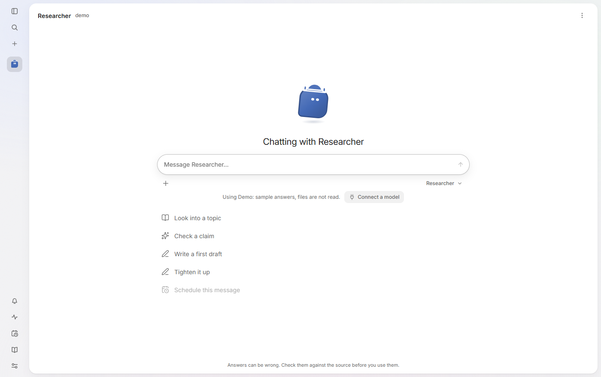
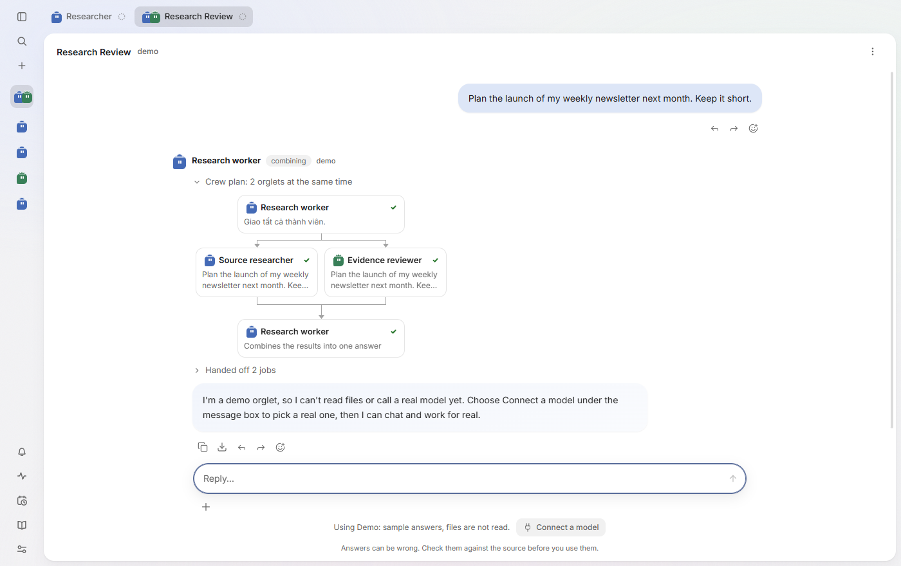
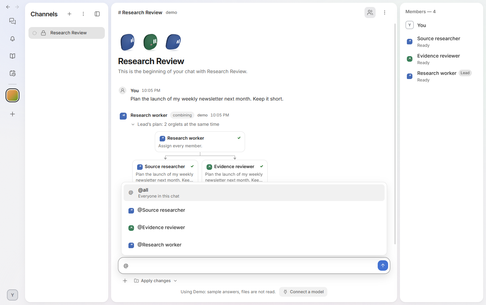

# Getting started

<picture>
  <source media="(prefers-color-scheme: dark)" srcset="images/orglets/getting-started-dark.png">
  
</picture>

Orglet is a desktop app. You keep a few AI workers, each with a name and a role, and you talk to them in a normal chat. There is no Orglet server. Chats, workers and files stay on this computer. A free CodePawl account is optional and syncs nothing yet.

This page is the first walk-through. The [user guide](user-guide.md) is the map of everything else, one short page per part of the app. How teams work in detail: [team-chat.md](team-chat.md). How to run tests and connect providers in depth: [technical-guide.md](technical-guide.md).

In the app, workers are called **orglets** and teams are called **crews**. This page uses both words.

Orglet is early. Expect rough edges, and check answers against your own sources before you rely on them.

## 1. Get the app

Use **Windows** or **macOS** (Apple silicon). An experimental Linux x64 ZIP is also available. You do not need an account. The first start asks whether to sign in to a CodePawl account or use Orglet without one; either works, and nothing syncs yet ([CodePawl account](account.md)).

### With one command (Windows)

With Node.js 20 or later, run:

```sh
npx @codepawlhq/orglet
```

It downloads the latest Setup from GitHub Releases and runs it only after two checks: the file matches the release byte for byte (SHA-256), and Windows accepts its signature from Open Source Developer Xuan An Nguyen. If either check fails, nothing is installed. `npx @codepawlhq/orglet install` updates to the latest release later.

### From a GitHub Release

The [latest release](https://github.com/codepawl/orglet/releases/latest) carries a Windows **Setup.exe** (installs per user and updates itself) and a **ZIP** (unzip and run; does not update itself). Each release also includes a signed, notarized Apple silicon macOS ZIP and an experimental Linux x64 ZIP when those builds passed; the **Downloads** line in the release notes says which platforms a release carries.

| If you use | Do this |
|---|---|
| Windows | Run Setup. SmartScreen may show **Windows protected your PC** while the signing certificate is new: check that it names **Open Source Developer Xuan An Nguyen** as the publisher, then **More info** → **Run anyway**. Details: [user guide → Install](user-guide.md#install). |
| macOS | Download the Apple silicon ZIP from the release, unzip `Orglet.app` and move it to Applications. A release only carries the macOS ZIP after Gatekeeper accepted it as notarized. There is no Intel Mac download yet. Details: [macos-packaging.md](macos-packaging.md). |

| Linux x64 | Download the experimental ZIP, unzip it and run the `Orglet` binary. CI passed a desktop smoke on Ubuntu; daily desktop use is not verified. There are no automatic updates. See [linux-packaging.md](linux-packaging.md). |

### From source

You need Node **24.19** or newer and pnpm **11.19.0**.

```bash
pnpm install --frozen-lockfile
pnpm dev
```

The Researcher worker starts on **Demo**, so you can try the app without any account.

## 2. First look

On first launch the window is US English. A **Researcher** worker is already there, on **Demo**. The app uses your system's usual interface font.

- The **rail** on the left shows each crew and orglet as a face. There is no task list. Click a face to open that chat; hover it for the name. **Open sidebar** at the top switches to the full **sidebar**, which lists them by name.
- Once you open a second chat, the chats you have open sit as **tabs** across the top.
- The **main column** is the conversation, headed **Chatting with …**. The message box sits at the bottom.
- The foot of the rail has **Notifications**, **Running**, **Schedules**, **Library** and **Settings**.

<p align="center">
  
</p>

To change language: **Settings** → **General** → **Language** (English (US), English (UK), or Tiếng Việt). To switch light or dark: **Settings** → **General** → **Appearance**.

The side buttons on a mouse, or Alt+Left and Alt+Right, go back and forward through the chats and panels you opened, like a browser.

## 3. Send a Demo message

1. Click **Researcher** on the rail.
2. Type a short message in the box at the bottom.
3. Send it.

You get a labelled sample reply. Demo does not call a model and does not read files. That is enough to see the layout. The line under the message box says the chat is on Demo, with a **Connect a model** button:

- If nothing is connected yet, it opens **Settings** → **API connections**. Add a key or a custom connection there, then close Settings. The orglet's settings open next, with that connection already chosen.
- If something is already connected (a signed-in harness, a saved key, a custom connection), it opens the orglet's settings straight away, with the first one that can run chosen.

Check the **Model** and **Model ID** fields and choose **Save orglet**. The chat header shows the new connection at once.

The orglet's settings are also in the chat's **⋯** menu, as **Orglet settings** (**Crew settings** in a crew's chat). **Chat settings** in the same menu renames the chat, changes who answers it and sets its cost limit.

To start a new conversation later, open **⋯** next to **Details** and choose **Archive**. The next message on that worker starts a fresh chat. Search still finds the old one.

## 4. Use a real model

When you want real answers, pick one path. Do not paste keys into chat.

### A. A plan you already pay for (Claude Code, Codex, Cursor Agent or Gemini CLI)

1. Install that tool on this computer and sign in to it. Gemini CLI signs in when you run `gemini` and choose **Sign in with Google**.
2. Open **Settings** → **Local harnesses**.
3. Check the row: **not installed**, **found on disk**, **signed in (ready)**, or **sign-in error**. **Found on disk is not ready.**
4. If it is not signed in, copy the login command from that row and run it, then choose **Rescan**. Orglet does not switch to Demo when sign-in fails.
5. In Researcher's chat, choose **Connect a model** (or **⋯** → **Orglet settings**). Set **Model** to that harness if it is not the one already chosen. Choose **Save orglet**.

Cost follows that tool's plan, not an Orglet API bill.

### B. An API key (OpenAI, Anthropic, or Grok)

1. Open **Settings** → **API connections**.
2. Turn on the provider. Paste the key and choose **Save key**, or choose **From file**.
3. Close Settings. If you started from **Connect a model**, the orglet's settings open with that provider chosen; otherwise open them from the chat's **⋯** → **Orglet settings** and set **Model** to that provider. Pick a model from the list or type an ID. Choose **Save orglet**.

Keys are encrypted on this computer. The app's interface never reads a saved key back. Backups do not include keys.

If the model list fails to load, you can still type an ID. Built-in names are suggestions, not a lock. More: [model-list-fetch.md](model-list-fetch.md) and [technical-guide.md](technical-guide.md).

## 5. Chat with a worker or a team

Click a **worker** to talk to that one worker. Click a **team** to talk to the group. Each has **one live chat**. A new message is a turn in that chat, not a new item in the sidebar. The sidebar never fills up with old jobs.

On a team, the lead plans, assigned members work as hidden jobs, and one report comes back. Open **Details** for those jobs, cost, retry, and cancel.

<p align="center">
  
</p>

In a **team** chat, type `@` to pick a worker or `@all`. Tagged names highlight. Demo then asks those members. Leave it untagged, or type `@all`, to ask everyone. A 1:1 worker chat has no `@` picker.

<p align="center">
  
</p>

How that works: [team-chat.md](team-chat.md).

## 6. Attach files

A worker only reads the files you attach to **that** chat.

1. Click the **+** next to the message box.
2. Choose **Files** (specific files) or **Folder** (up to 20 supported files).
3. Write what you want done, then send.

Attached files sit in a row of cards above your message, each with an icon for what it is (spreadsheet, document, data, code, plain text), its name and its size. The row scrolls sideways when there are many. Hover a card to remove it.

Demo cannot analyze files. Switch **Model** off Demo first. Reports can open like a document: copy as plain text or Markdown, or download them.

## What this page does not cover

Everything else is one short page each in the [user guide](user-guide.md): crews and group chats, connections, permissions and the working folder, memory and knowledge, schedules, notifications, settings, backup, and troubleshooting. Product fit and the **Not now** list stay in [product.md](product.md).
