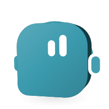

# MCP servers

<picture>
  <source media="(prefers-color-scheme: dark)" srcset="images/orglets/mcp-dark.png">
  
</picture>

MCP (Model Context Protocol) is how many apps let an AI use other services: GitHub, a calendar, a database, a search engine. You can add MCP servers to Orglet and let an orglet use their tools. Every call goes through Orglet's own tool loop and permissions: you choose which orglet may use which server, and the orglet asks you in the chat before it calls a tool you have not allowed yet.

Part of the [user guide](user-guide.md). Tool permissions in general are in [agent-tools.md](agent-tools.md).

## Add a server

1. Open **Settings → MCP** and choose **Add server**.
2. Give it a **Name**, for example `GitHub`.
3. Under **How to connect**, pick one:
   - **Run on this computer (stdio)**: the **Command** that starts the server (for example `npx`) and its **Arguments**, one per line (for example `-y` and `@modelcontextprotocol/server-github`). Add the **Environment variables** it needs, such as `GITHUB_TOKEN`.
   - **Remote (HTTP)**: the server's **Address**, and a **Bearer token** or **Headers** if it needs them.
4. Choose **Save server**. Orglet starts the server once to test it, and the row shows **Connected** with its tools, or **Connection error** with the reason.

Each row has a switch to turn the server off and a menu with **Test connection**, **Edit** and **Remove**. When you edit a server, a saved value shows as dots. Leave it empty to keep it, or type a new one to replace it.

Arguments are shown in the app. Put tokens in environment variables or headers, never in the arguments.

**Import from a file.** **Import from a file** reads a JSON file you pick, in the `mcpServers` format most apps use (`servers` in VS Code's). Orglet never looks for another app's MCP settings on its own. It does not read Claude Desktop, Cursor or VS Code files unless you pick one.

## Let an orglet use a server

An orglet uses no server until you pick one.

1. Open the orglet's settings and its **Permissions** tab.
2. Under **MCP servers**, tick the servers it may use.
3. Choose **Save orglet**.

A crew uses the servers each member is allowed to use. The choice is saved with the orglet, like its other settings, so a run that already started keeps the list it started with.

## Approve a call

The first time an orglet calls a tool in a chat, the chat stops and shows who wants to use which tool, and the arguments it chose. You answer with:

- **Allow once**: this call runs, and the next one asks again.
- **Always allow this tool**: this tool runs without asking in this chat.
- **Always allow** *server*: every tool of this server runs without asking in this chat.
- **Refuse**: the call does not run. The orglet is told you refused and carries on without it.

In a side thread the card offers only **Allow once** and **Refuse**: a side thread never allows more than its main chat, and taking a grant away in the main chat takes it from its side threads too ([team-chat.md](team-chat.md#side-threads)). "Always" lasts for this chat only. To take it back, open the chat's **Details → Tool permissions**, where each server the chat's orglets may use has a switch, and each tool you allowed on its own has one too. Turning one off stops nothing already running; the next call asks again.

A crew or group chat cannot stop mid-turn to ask. There, a tool you have not allowed comes back to the orglet as refused and the trace says so. Allow the server in **Details → Tool permissions** first, then send the message again.

Scheduled runs never get MCP tools, because nobody is there to approve a call. Demo does not call tools.

## What the orglet gets back

- Text only. Images, audio and files the server returns are named, not shown to the model.
- At most 24,000 characters per call. A longer answer is cut, and the orglet is told it was cut.
- The answer is untrusted data, like a web page. Instructions inside it do not give the orglet any permission. An app change the orglet proposes after reading it always waits for your click.
- A call may take 60 seconds. At the limit, or when you stop the chat, Orglet cancels the call on the server too.

Each call is a row in the trace above the answer, for example "Used MCP tool: search_issues · GitHub". A refused or failed call is a row too.

## How it works

**Where servers run.** Stdio servers run as child processes of Orglet's core, the background process that also runs the tool loop, so a call and its cancel stay in one place. A server starts the first time something needs it: **Test connection**, or a chat whose orglet may use it. It stops when you turn it off, edit it, remove it, or quit Orglet. On quit, or if the core itself stops, the app also stops each server's process tree, but only a process whose id and creation time still match the server Orglet started; a process it cannot confirm is left alone rather than risk stopping another program that reused the id. If a server crashes, its row shows **Connection error** and the call comes back as a failed tool call; the rest of the app keeps working. Whatever a server writes to its error output is discarded; it never reaches the window.

**Secrets.** Environment variable values, header values and the bearer token are encrypted with your system's secure storage (DPAPI on Windows, Keychain on macOS), next to the API keys and not in the database. The window never reads them back. The core asks for them only when it starts the server. Backups and crew templates never carry them. **Erase all data** in **Settings → Data** keeps your servers and their values, like it keeps API keys and custom connections; remove a server in **Settings → MCP**.

**Environment.** A stdio server gets only a small set of system variables (such as `PATH`, `TEMP` and `USERPROFILE`) plus the ones you add. It does not get Orglet's own environment.

**Network.** A server you add is your choice to connect a service, so it can use the network. That is different from commands in a working folder, which have no network at all, not even loopback. Adding an MCP server does not give workspace commands any network access. A remote server must use `https://`, or `http://` on this computer only (`localhost`, `127.0.0.1`), so a token never travels in the clear.

**Harness orglets.** Claude Code, Codex, Cursor Agent and Gemini CLI keep their own MCP turned off exactly as before (`--strict-mcp-config`, the Cursor rule that denies `Mcp(*:*)`, and Gemini CLI's `--allowed-mcp-server-names` with an unused name). An orglet on a harness reaches your MCP servers only through Orglet's tool loop: the CLI picks a call, and Orglet checks and runs it. An orglet with a server picked uses that loop even when it has no working folder.

**Unknown outcomes.** A call that was running when the app closed has an unknown outcome. If the server marks the tool read-only, it may run again. Any other tool is treated like an interrupted file edit: the chat asks you to review it in **Details → Files and processes** before it continues.

## What it cannot do

- Servers that need a browser sign-in (OAuth) are not supported. Use a token instead.
- Orglet offers servers nothing back: no sampling (using your model), no roots, no elicitation.
- Resources and prompts from a server are not used; only tools are.
- At most 20 servers and 64 tools per server. Tools beyond that, or with a schema over 16 KB, are left out and the row says how many.
- A tool list is frozen when a run starts. A server that changes its tools mid-run is seen from the next message on.

| Limit | Value |
|---|---|
| Servers | 20 |
| Tools per server | 64 |
| Result per call | 24,000 characters |
| Call timeout | 60 seconds |
| Start and first listing | 20 seconds |
| Arguments per call | 64 KB |
