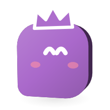

# Product direction

<picture>
  <source media="(prefers-color-scheme: dark)" srcset="images/orglets/product-dark.png">
  
</picture>

Decided with An on 2026-09-17. Use this page to settle product questions before building; change it when a decision changes.

## One line

Orglet is a desktop app where you keep a small team of AI workers, give them work in plain chat, and let them run on the AI subscriptions you already pay for, with your files and history staying on your computer.

## Who it is for

1. **People who work alone.** Freelancers, creators and solo founders who have more to do than time, and want help that remembers how they like things done.
2. **Everyday users.** People comfortable with ChatGPT or Claude who want something more organized, without learning agent frameworks, prompts or APIs.

Orglet is not built for companies that need shared accounts, permissions or admin controls. That can come later if the open-source community wants it.

## Why pick Orglet over a chat app

All four of these matter. When two conflict, the order below breaks the tie.

1. **A team with roles.** Each worker has a name, avatar, instructions and a skill. You talk to one worker, a few of them, all of them, or a team, and they can see what the others said.
2. **Your existing AI plan.** Workers can run through Claude Code or Codex using the account you are already logged in to, so there is no extra API bill. An API key is optional.
3. **Private by default.** No Orglet account. Chats, workers and files live in a local database. A worker reads only the files you attach to that task.
4. **Repeat work runs itself.** Routines send the same request daily or weekly while the app is open. If the machine was off, the schedule is still there: missed runs become one catch-up choice, not a vanished calendar.

## How it should feel

- **A chat first.** Click a team to open that team's conversation, or a worker for theirs. A task is that chat. Workers answer like coworkers, and a formal report only appears when you ask for one or a team checklist needs it.
- **Documents like attachments.** A report arrives as a file you open, not a wall of text in the chat.
- **Quiet while working.** Show a spinner and a short status. Versions, paths and costs live in Details.
- **Nothing to set up to start.** New installs speak US English, include a demo worker and pick avatars and titles automatically. Vietnamese and UK English are in Settings.
- **Clear about limits.** Answers can be wrong. The app says so once, plainly, and never hides where an answer came from.
- **Your model, not ours.** A worker's model is a provider plus an ID the user chose or typed. Built-in names are suggestions. Lists come from that provider's own API or CLI and are cached on this computer; a failed fetch still leaves a custom ID field. A deprecated ID gets a quiet chip, with a sunset date only when the native list included one. See [model-list-fetch.md](model-list-fetch.md).

## Words we use

| In the app | Meaning |
|---|---|
| Chat | One live conversation with a worker or a team. Stored as a `tasks` row under the hood. |
| Worker (Nhân viên) | An AI coworker with a role, instructions and a skill. Click the worker to open **that worker's chat**. |
| Team (Nhóm) | Workers who take a message together and combine their results. Click the team to open **that team's chat**. |
| Routine (Lịch chạy) | A request that repeats on a schedule |
| Skill / Knowledge | Reusable instructions and notes workers can use |
| Capability | A concrete action, such as reading an attachment, editing a granted folder, running a check, or reading the web. The chat Details shows whether each worker can do it now and what setup is missing. |
| Proposal (Đề xuất) | An app change a worker suggests when you ask for one (a new orglet, a crew, a template, a skill, a schedule, a setting): a card in the chat you apply or dismiss. Setup help on request, not an agent running the workspace; see [agent-tools.md](agent-tools.md#proposing-app-changes). |
| Connection | The API or signed-in local CLI that runs the model. A skill, imported package, or note never grants a capability. |

Projects that group several tasks are postponed until real use shows a need (shared files or shared context across tasks).

A worker's **Permissions** tab and the chat Details show its abilities as controls you set: a switch for anything with exactly two values, a dropdown for the working folder's levels (owner's rule, COD-168). A blocker such as Demo or a missing connection disables the control with one reason beside it, never a third position. File and web access belongs to the chat; the worker's tab acts on that worker's own chat, a team chat on its own, and both can be set before the first message. Changes apply to every run that has not started yet, while revocation blocks active access. Technical tool names stay in the tool guide. Routines decide when a turn starts; they do not grant access.

**Team and worker chat (COD-24 + COD-25 + COD-26, shipped):** click a worker or a team → that conversation. One live thread each (find-or-create a `tasks` row; a user message is a turn, not a new row). The sidebar is workers and teams, not a task pile. In a team chat, type `@` to tag who should take that turn ([COD-36](https://linear.app/codepawl/issue/COD-36)). The synthesizer plans, assigned members run as hidden jobs, one report comes back. How it works: [team-chat.md](team-chat.md). Long-chat context, memory, cost and fail-closed defaults: [team-chat-context.md](team-chat-context.md).

## Release

- **Open source under AGPL-3.0, with a CLA.** The repository is public. Contributors sign the CLA so the project can also sell commercial licenses or be acquired later. Parts meant for reuse, such as the UI components, can be released under a more permissive license later.
- **Every device.** Orglet is for Windows, macOS and Linux, and later iOS and Android. Windows is built and tested first (**0.2.0** ships Windows-only connections for Claude Code, Codex, Cursor Agent, OpenAI, Anthropic and Grok/xAI). macOS has ZIP packaging and a `macos-latest` typecheck/test/make job that Developer ID signs when secrets exist (notarization still needs Apple ID or an App Store Connect API key); that job is not the required merge check. Linux packaging is still later. Public Windows 0.2.x installers stay unsigned; see [windows-release-gates.md](windows-release-gates.md) and [macos-packaging.md](macos-packaging.md).

## Not now

- Company simulation, org charts or agents that run a business
- Cloud sync, accounts or running while the computer is off
- A skill marketplace or running downloaded scripts
- Promising that every provider or subscription works the same way
- Scraping provider docs or using a third-party model aggregator as the source of truth for lists or sunset dates ([model-list-fetch.md](model-list-fetch.md))
