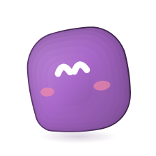

# Product direction

<picture>
  <source media="(prefers-color-scheme: dark)" srcset="images/orglets/product-dark.png">
  
</picture>

Decided with An on 2026-09-17. Use this page to settle product questions before building; change it when a decision changes.

## One line

Orglet is a desktop app where you keep a small team of AI workers, give them work in plain chat, and let them run on the AI subscriptions you already pay for, with your files and history staying on your computer.

## Who it is for

1. **People who work alone.** Freelancers, creators and solo founders who have more to do than time, and want help that remembers how they like things done.
2. **Everyday users.** People comfortable with ChatGPT or Claude who want something more organized, without learning agent frameworks, prompts or APIs.

Orglet is not built for companies that need shared accounts, permissions or admin controls. That can come later if the open-source community wants it.

## Why pick Orglet over a chat app

All four of these matter. When two conflict, the order below breaks the tie.

1. **A team with roles.** Each worker has a name, avatar, instructions and a skill. You talk to one worker, a few of them, all of them, or a team, and they can see what the others said.
2. **Your existing AI plan.** Workers can run through Claude Code or Codex using the account you are already logged in to, so there is no extra API bill. An API key is optional.
3. **Private if you want it.** Orglet works fully without an account: chats, workers and files live in a local database and nothing leaves the computer. An optional Orglet account (COD-329; signing in exists since COD-337, sync does not yet) will sync workers, crews, chats and settings between your computers, and later to a phone. A new install asks which one the person wants, with signing in as the main button. Sign-in is email and password with a verification code, Google or GitHub. It is one CodePawl account, shared with Orglet on the web and the rest of CodePawl. Keys and harness sign-ins never sync, and a chat or orglet marked "only on this computer" never leaves it. Signed in, Orglet sends usage statistics and scrubbed error reports, never chat text, files, names or keys, and one switch turns that off; without an account nothing is sent. The account is free. Orglet stays free and open source; only a model router that may come later is paid. A worker reads only the files you attach to that task.
4. **Repeat work runs itself.** Routines send the same request daily, on weekdays, weekly or every few hours (never more often than hourly) while the app is open, within a daily cost cap when one is set. If the machine was off, the schedule is still there: missed runs become one catch-up choice, not a vanished calendar.

## How it should feel

- **A chat first.** Click a team to open that team's conversation, or a worker for theirs. A task is that chat. Workers answer like coworkers, and a formal report only appears when you ask for one or a team checklist needs it.
- **Documents like attachments.** A report arrives as a file you open, not a wall of text in the chat.
- **Quiet while working.** Show a spinner and a short status. Versions, paths and costs live in Details.
- **Nothing to set up to start.** New installs speak US English, include a demo worker and pick avatars and titles automatically. Vietnamese and UK English are in Settings.
- **Clear about limits.** Answers can be wrong, and the app never hides where an answer came from. (The standing line under the prompt bar that said so was removed at the owner's request, 2026-10-01.)
- **Your model, not ours.** A worker's model is a provider plus an ID the user chose or typed. Built-in names are suggestions. Lists come from that provider's own API or CLI and are cached on this computer; a failed fetch still leaves a custom ID field. A deprecated ID gets a quiet chip, with a sunset date only when the native list included one. See [model-list-fetch.md](model-list-fetch.md).

## Words we use

| In the app | Meaning |
|---|---|
| Chat | One live conversation with a worker or a team. Stored as a `tasks` row under the hood. |
| Worker (Nhân viên) | An AI coworker with a role, instructions and a skill. Click the worker to open **that worker's chat**. |
| Channel (Kênh) | A named chat with a topic, like Slack's or Discord's #launch, whose members are orglets. **How it works** is the channel's setting: each orglet answers in turn, or a lead plans, splits the work among them and combines it (what a crew, or team, used to be). A one-to-one chat with an orglet is its DM. |
| Routine (Lịch chạy) | A request that repeats on a schedule |
| Skill / Knowledge | Reusable instructions and notes workers can use |
| Capability | A concrete action, such as reading an attachment, editing a granted folder, running a check, or reading the web. The chat Details shows whether each worker can do it now and what setup is missing. |
| Proposal (Đề xuất) | An app change a worker suggests when you ask for one (a new orglet, a channel where the lead splits the work, a template, a skill, a schedule, a setting): a card in the chat you apply or dismiss. Setup help on request, not an agent running the workspace; see [agent-tools.md](agent-tools.md#proposing-app-changes). |
| Connection | The API or signed-in local CLI that runs the model. A skill, imported package, or note never grants a capability. |

**Marketplace (COD-373).** By the owner's decision on 2026-10-01, Orglet gets a marketplace of ready-made orglets and crews (channels where a lead splits the work, COD-369) now that the CodePawl account exists. Adding one makes it a friend: a local orglet you own and can edit, never a live link. Browsing and adding need no account; publishing does. Listings contain template instructions, skills and existing avatar metadata, never scripts that run, permissions, folders or keys. Listing presentation is text only, with no screenshots or image uploads. Each account version waits for an explicit human review. Reports inform that review and never hide a listing automatically; withdrawal leaves installed copies intact. Design: [marketplace-design.md](marketplace-design.md).

Channels (COD-361) are how several orglets share one conversation, by the owner's decision on 2026-10-01: they revisit the "projects that group several tasks" this page used to postpone, as named chats rather than folders of tasks. A channel is still one chat; shared files and shared context across separate chats stay postponed until real use shows a need. Channels are local. Their members can later include people (COD-362, after account sync), and nothing is built for people yet. Crews and channels are one concept since COD-369 (owner, 2026-10-01): a crew is a channel where the lead splits the work, and its lead, workflow, budget and hours are that channel's settings.

A worker's **Permissions** tab and the chat Details show its abilities as controls you set: a switch for anything with exactly two values, a dropdown for the working folder's levels (owner's rule, COD-168). A blocker such as Demo or a missing connection disables the control with one reason beside it, never a third position. File and web access belongs to the chat; the worker's tab acts on that worker's own chat, a team chat on its own, and both can be set before the first message. Changes apply to every run that has not started yet, while revocation blocks active access. With an editable folder, an orglet's changes wait for the person to review and apply them unless the chat's review switch is off; channels and schedules apply as each run finishes (COD-279). Technical tool names stay in the tool guide. Routines decide when a turn starts; they do not grant access.

**Team and worker chat (COD-24 + COD-25 + COD-26, shipped):** click a worker or a team → that conversation. One live thread each (find-or-create a `tasks` row; a user message is a turn, not a new row). The sidebar is workers and teams, not a task pile. In a team chat, type `@` to tag who should take that turn (COD-36). The synthesizer plans, assigned members run as hidden jobs, one report comes back. How it works: [team-chat.md](team-chat.md). Long-chat context, memory, cost and fail-closed defaults: [team-chat-context.md](team-chat-context.md).

## Release

- **Open source under AGPL-3.0, with a CLA.** The repository is public. Contributors sign the CLA so the project can also sell commercial licenses or be acquired later. Parts meant for reuse, such as the UI components, can be released under a more permissive license later.
- **Every device.** Orglet is for Windows, macOS and Linux, and later iOS and Android. Windows is the public release target, with Certum-signed installers. macOS has ZIP packaging and a `macos-latest` typecheck/test/make job that Developer ID signs when secrets exist (notarization still needs Apple ID or an App Store Connect API key); that job is not the required merge check. Linux CI builds a ZIP and starts it headlessly, but use on a real Linux desktop remains unverified. See [windows-release-gates.md](windows-release-gates.md), [macos-packaging.md](macos-packaging.md) and [linux-packaging.md](linux-packaging.md).

## Not now

- Company simulation, org charts or agents that run a business
- Running work while every computer is off (a cloud runner). The [CodePawl AI router](ai-router-design.md) is not that: a router relays the model call, and orglets still run on the person's computer.
- Building the Orglet account before its design in COD-329 is settled: what syncs, encryption, conflicts, offline use
- Running downloaded scripts, from the marketplace or anywhere else
- Promising that every provider or subscription works the same way
- Scraping provider docs or using a third-party model aggregator as the source of truth for lists or sunset dates ([model-list-fetch.md](model-list-fetch.md))
