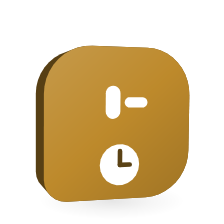

# Routine catch-up

<picture>
  <source media="(prefers-color-scheme: dark)" srcset="images/orglets/routines-dark.png">
  
</picture>

This is the current scheduler policy. It matches `apps/desktop/src/core/orchestration/routines.ts`. Do not add cloud cron or run work while the machine is off.

## What runs, and when

Orglet checks schedules only while the app is open. The core process polls every five seconds (`apps/desktop/src/core/entry.ts`). Closing the app, sleeping, or shutting the machine down creates no tasks.

Each enabled routine stores one next due instant in UTC (`nextDueAt`) in the schedule's IANA timezone. There is no `lastRun` / `nextRun` field and no queue of missed dates.

## Missed window

A due routine is a **miss** — and is not started automatically — when any of these is true (`shouldDeferRoutine`, threshold `ROUTINE_MISS_MS` = 30 seconds):

1. **Reopen / first tick:** `lastTick` is null (process just started).
2. **Gap:** more than 30 seconds since the previous tick (sleep, hang, or the app was not polling).
3. **Late:** the due time is already more than 30 seconds in the past.
4. **Already waiting:** `pending` is set.

On-time dispatch happens only on a continuous tick: the previous tick was recent, the due time is at most 30 seconds old, and there is no pending catch-up. Opening the app at or after the scheduled time therefore prompts for catch-up instead of silently starting work.

A daylight-saving gap is skipped by `nextOccurrence`; a repeated local time runs at its first instant. Those are schedule math, not catch-up.

## Catch-up is one pending, one run

Missed occurrences are **coalesced**. `defer()`:

- keeps **at most one** `pending` object per routine (`pending` is a single nullable record, not a list);
- preserves `pending.dueAt` as the first missed due (`routine.pending?.dueAt ?? routine.nextDueAt`);
- advances `nextDueAt` to the next future occurrence from *now*, so the calendar does not disappear and does not replay a backlog.

**N = 1.** **Chạy bù một lần** (`catchUpRoutine`) creates **one** task if the routine is enabled and `pending` is set. It does not drain missed days. A second catch-up is blocked until a later miss, and overlapping catch-up calls share a per-routine `dispatching` lock.

**Bỏ qua lần lỡ** (`dismissRoutine`) clears `pending` only. It does not move `nextDueAt` and does not create a task.

Saving a routine recomputes `nextDueAt` from the current clock and sets `pending: null`.

## After a long time off

Example: a daily 09:00 schedule, machine off for 30 days, app opened again.

1. No tasks were created while the machine was off.
2. The first tick sees `lastTick === null` and an overdue `nextDueAt`, so it defers.
3. The UI shows one missed-run prompt with that first missed `dueAt`, the skip reason, and the already-advanced next due time.
4. The user runs catch-up once, dismisses, or leaves the prompt. The next scheduled time remains on the calendar either way.

Guards that still apply to catch-up: recurring approval fingerprint, a non-terminal prior task, source byte verification, and a revision check. Occurrence advancement and task insert share one database transaction.

## What this is not

- No OS wake timer, background agent, or cloud cron.
- No automatic burst of one task per missed day.
- No catch-up while the computer is off.
