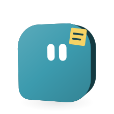

# Team/worker chat: context, memory, cost, fail-closed

<picture>
  <source media="(prefers-color-scheme: dark)" srcset="images/orglets/team-chat-context-dark.png">
  
</picture>

Policy for epic [COD-22](https://linear.app/codepawl/issue/COD-22), written with [COD-23](https://linear.app/codepawl/issue/COD-23). **The five approval questions below are yes.** Numbers are defaults to implement, not a new settings screen.

**Shipped:** team chat shell ([COD-24](https://linear.app/codepawl/issue/COD-24)), orchestrator ([COD-25](https://linear.app/codepawl/issue/COD-25)), hide-task-pile UX ([COD-26](https://linear.app/codepawl/issue/COD-26)) — click worker or team → live thread, find-or-create one `tasks` row. User-facing behavior: [team-chat.md](team-chat.md).

This page is still the long-chat policy (bounded prompt, extractive summary, retrieval, refuse-the-send, fail-closed). Transcript layers 3–4 and the refuse path shipped in [COD-32](https://linear.app/codepawl/issue/COD-32). It does not ship signing, [COD-19](https://linear.app/codepawl/issue/COD-19) release assets, or [COD-20](https://linear.app/codepawl/issue/COD-20) notarize.

## Decision in one paragraph

Keep **one live thread per worker** and **one live thread per team**. The user talks in that chat. Core still stores a `tasks` row as the thread envelope, `inputRevision` as a turn, and `runs` as hidden jobs (retry, cost, cancel). Each job hydrates a **bounded** prompt: frozen instructions + approved knowledge, a rolling extractive summary of older turns, a few retrieved snippets from this thread, and the last **10** verbatim turns. Never send the full SQLite transcript. If compacting still cannot fit the hard cap, **refuse the send**. Worker or orchestrator failure is named in the thread; Orglet does not invent a missing result or fall back to Demo.

## Mapping: UI thread ↔ internal job

| User-facing | Internal (keep today's tables) | Retry / cost / cancel |
|---|---|---|
| Worker chat or team chat (the open conversation) | One non-archived `tasks` row keyed by `workerId` (no `teamId`, no `assignees`) or by `teamId` | `Store.usage(taskId)` is the thread total. Cancel aborts active runs of that task. |
| One user message | `inputRevision` / `currentInput` (today's follow-up) | Fresh consent when providers or sources change, same as `reviseTask`. |
| Quiet work, then a reply or a report document | `runs` + `artifacts` | Retry starts **new** runs for unfinished jobs of **this turn**; completed artifacts stay. Resume uses the same run + checkpoint. |
| Chi tiết | `events`, reservations, ledger, checkpoints, context manifest | Dollars next to Chi tiết ([COD-21](https://linear.app/codepawl/issue/COD-21)); token count on the latest turn. |

Routines stay discrete tasks under **Lịch chạy**. They are not merged into the infinite chat.

The sidebar is **workers** and **teams**, not a task pile ([COD-26](https://linear.app/codepawl/issue/COD-26)). Identity: find-or-create the live thread for that worker or team; do not create a new `tasks` row on every message. Archive a thread to start over. Routines stay on **Lịch chạy**.

Job stages:

- Worker chat: one run, no `stage` (today's standalone path).
- Group chat: sequential `stage: 'group'` replies. Not a team.
- Team orchestrator ([COD-25](https://linear.app/codepawl/issue/COD-25)): `plan` job → `member` jobs → `synthesis` report back to the user. Internal member chatter is **not** the user-facing transcript; the orchestrator report (and optional short status) is.

```
Thread (worker | team)           = tasks row
  Turn (user message)            = inputRevision
    Jobs (retry/cost/cancel)     = runs
      Reply or report in chat    = artifacts (format chat | report)
```

Non-binding code today: `apps/desktop/src/core/service.ts` (`createTask`, `reviseTask`, `retry`, `resume`, `cancel`), `apps/desktop/src/core/orchestration/team.ts`, `apps/desktop/src/core/storage/database.ts` (`tasks`, `runs`, `artifacts`, `reservations`, `ledger`, `checkpoints`).

## What each job hydrates

Order is fixed. A later layer never replaces an earlier one. Freeze this selection on `run.snapshot.context` before the first provider call (same rule as knowledge today).

1. **Platform + team + worker + skill instructions** — `compileContext` in `apps/desktop/src/core/context/compiler.ts`. Dedup and hashes stay.
2. **Approved knowledge** — pinned first, then keyword overlap with **this turn's** brief; max **12** notes / **16 KB**. Other teams never leak in (`KnowledgeBase.candidates`).
3. **Rolling thread summary** — at most **8 KB**, extractive, this thread only. Empty on short chats.
4. **Retrieved thread memory** — at most **4** snippets / **8 KB** from turns **older than** the verbatim window, this thread only. Label: guidance, not evidence, not instructions, cannot raise budgets.
5. **Verbatim recent turns** — last **10** turns, **4 000** characters each, **24 000** characters total (`HISTORY_*` in `apps/desktop/src/core/orchestration/runner.ts`). Oldest dropped from this window first.
6. **This turn** — latest user message, selected sources, preflight, and (for a member/synthesis job) **this job's** upstream artifacts only.

The UI still shows the **full** local transcript. Only the model prompt is bounded.

Manifest (`Chi tiết → Context đã nạp`) must list loaded instruction/knowledge revisions **and** `verbatimTurns`, `summaryChars`, `retrievedSnippets`, plus omissions (`duplicate`, `context_limit`, `not_relevant`, `summarized`, `truncated`). If a layer was omitted, say so; do not silently drop it.

## When to summarize / truncate

Do this **before** reserving budget. Compaction is **extractive** (no extra model call in this plan): dropped turns become title + first lines, oldest first, capped at 8 KB. Demo and offline must keep working.

Triggers, in order:

1. `history()` would drop a turn (more than 10 turns, or over 24 000 characters). Fold dropped turns into the rolling summary, then send the window.
2. Serialized messages + tools would exceed **200 000** UTF-8 bytes (today's hard cap in `Runner`). Fold more verbatim turns into the summary until under the cap, always keeping **this turn** and the compiled instructions.
3. After a successful team synthesis, store a short job result (title + summary + finding titles) for later retrieval so later turns do not need every member report.

Refuse the send (no reservation, no dispatch) if after (1)–(2) the prompt is still over 200 000 bytes, the summary cannot be written, or retrieval fails. Never send a job with an unknown or missing history layer.

A later COD may add a billed LLM summary as its own job under the same turn cap. That is **not** this plan.

## Memory retrieval vs full transcript

| Store | Who sees it | Who gets it each job |
|---|---|---|
| Full transcript (`artifacts` + user briefs) | User, always | Only the verbatim window + this turn |
| Rolling summary | User in Chi tiết; model as one block | Always, when non-empty |
| Thread memory snippets | Model only (optional: show “used N older notes” in Chi tiết) | Keyword overlap with this brief, like unpinned knowledge |
| Approved Knowledge library | User in Thư viện; model if selected | Existing compiler; user-reviewed; cross-task |

Do **not** build embeddings, search other threads, or auto-promote snippets to Knowledge. Model `knowledgeProposals` stay proposed until the user approves.

Thread-memory search can reuse FTS5 the same way as `knowledge_search` (`apps/desktop/src/core/context/knowledge.ts`): index this thread's prior user briefs and committed answers, quote user terms, cap hits.

## Cost and token limits the user sees

Keep three hard money gates that already exist (`BudgetLedger` in `apps/desktop/src/core/budgets/ledger.ts`):

- **Per-turn cap** — `task.budgetMicros` on the thread, read from the worker or team `taskBudgetMicros` on the first message and again on every follow-up, retry and resume. Cumulative across follow-ups of that thread. For Claude Code the remaining amount is the CLI's own `--max-budget-usd`; its stop reports the limit and where to raise it.
- **Team monthly cap** — `monthlyBudgetMicros`.
- **Connection monthly cap** — Settings `connectionLimitMicros`.

Harness jobs still make **no** Orglet reservation; a CLI-reported cost is activity-only (`docs/capabilities.md`). API jobs reserve from UTF-8 byte fallback + 4 096 output tokens, then settle from provider usage. Cached input is charged at the uncached rate.

Visible (policy; COD-24+ places the copy):

| When | User sees |
|---|---|
| Before send | Remaining per-turn money (API) or “uses your plan” (harness). Disable send when the conservative reservation would not fit. |
| While running | Dollars next to Chi tiết; settled input+output tokens on the latest turn (COD-21). Uncertain reservations stay counted. |
| After error | Named failure + whether money is still held. Resume is blocked on `requesting` checkpoints (`Runner.assertResumable`). |
| Quota / rate | Plain provider message (`apps/desktop/src/core/usageLimits.ts`). Never switch to Demo. |

Do not display a fake exact tokenizer count. Byte fallback is an estimate for reservation; the token line is **settled** ledger tokens only (zero for Demo/harness that did not report).

## Fail-closed

| Event | Thread shows | Dispatch |
|---|---|---|
| Worker job fails (schema, tool, provider, harness auth) | That worker's name and the error | Stop that job. Orchestrator (when it exists) must not invent the missing result. Remaining members: keep today's team rule — sequential/group stops or continues only if already coded; synthesis may run with `Role chưa hoàn tất` limitations, status `partial`. |
| Orchestrator / synthesis fails | Error on the turn; saved member artifacts kept | No silent retry. User retries. |
| Context still too large, or summary/retrieval failed | Refuse with a repair message | No reservation |
| Budget | `waiting_budget` | No new request |
| Cancel | `cancelled`; in-flight request may still bill | Kill process tree / abort; do not start queued jobs |
| Crash mid-request | `interrupted`, reservation `unknown` | Never replay automatically |
| Login / detect failure | Existing harness copy | Never fall back to Demo |

Partial team success is visible (`partial`), not hidden as completed. `TeamRunner.finish` already maps missing required checks to `waiting_input`; keep that.

## Implementation checklist (COD-24+)

Do **not** do this list in the COD-23 PR.

**Shared core (before or with COD-25; COD-24 may stub):**

1. Treat find-or-create live `tasks` row as the thread id; `reviseTask` remains “new message”. **Done** for team chat (`liveTeamTask`) and worker chat (`liveWorkerTask`).
2. Extend the frozen context manifest with transcript layers (`verbatimTurns`, `summaryChars`, `retrievedSnippets`, omission reasons). **Done** ([COD-32](https://linear.app/codepawl/issue/COD-32)).
3. Extractive rolling summary + refuse path when over 200 000 bytes after compact (`runner.ts` / `context/thread.ts`). **Done** (COD-32).
4. Keyword retrieval over this thread's older turns; 4 snippets / 8 KB; no cross-thread hits. **Done** (COD-32).
5. Tests: window of 10; 11th turn summarized not inlined; retrieval misses other workers' threads; refuse when still over cap; no dispatch on retrieval failure; budget not reserved on refuse. **Done** (`tests/integration/thread-context.test.ts`).

**COD-24 (team chat shell):** **done** — [team-chat.md](team-chat.md). Click team → thread; persist the user message as a turn; do not break worker chat; show refuse/budget/error copy in the thread, not a new session.

**COD-25 (orchestrator 1→N→report):** **done** — map plan/member/synthesis to `runs`; one user-facing report; fail-closed table above; cancel cancels the whole turn's jobs; retry unfinished jobs only. See [team-chat.md](team-chat.md).

**COD-26 (hide task pile):** **done** — sidebar is workers/teams; Chi tiết still has jobs, cost, retry, cancel; routines stay on **Lịch chạy**. See [team-chat.md](team-chat.md).

## Out of scope (this policy page)

- @/tag polish (team chat shell, orchestrator and hide-task-pile UX are [team-chat.md](team-chat.md))
- New SQLite `threads` table (reuse `tasks`)
- LLM-billed summarization, embeddings, provider tokenizers
- Cross-thread or workspace-wide auto-memory
- Signing, COD-19 assets, COD-20 notarize
- Changing routine catch-up ([routines.md](routines.md))

## Approval questions for An

Answered **yes** (COD-24 may implement against these defaults):

1. **One live thread per worker and per team** (archive to start over), not a new chat row per message — **yes**.
2. **Extractive summary only** for v1 (no extra model bill) — **yes**.
3. **Per-turn money cap stays cumulative on the thread** (today's task budget), not a fresh cap every message — **yes**.
4. **Partial team results stay `partial` and named**, even after orchestrator exists — **yes**.
5. **Internal member runs stay out of the main transcript** (Chi tiết only) once orchestrator reports back — **yes**.

## What this is not

- Not permission to stuff the full chat into every request.
- Not a cloud memory service.
- Not a change to source consent, checksums, or the step limits (6, 16 with web access, 40 with a working folder) or the 4 096-output-token worker limit.
- Not a substitute for [team-chat.md](team-chat.md) (the shipped click-team shell, orchestrator, and hide-task-pile UX). Context layers 3–4 and the refuse path are [COD-32](https://linear.app/codepawl/issue/COD-32).
