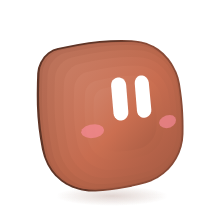

# Team and worker chat

<picture>
  <source media="(prefers-color-scheme: dark)" srcset="images/orglets/team-chat-dark.png">
  
</picture>

Team plans can declare an expected output, dependencies on other assigned members, and workspace resources they intend to change. With a workspace grant, the lead can inspect its files and brief through read-only tools before choosing those paths. Members report whether their assignment completed or is blocked; a saved blocker report remains visible but does not satisfy a dependency. A file assignment with no integrated changes is blocked even if its report claims completion. Failed prerequisites block downstream work and remain visible in the final status. Independent members can still run two at a time; overlapping file or directory ownership is serialized, including case aliases on Windows. Resource ownership does not grant permission to edit files.

The core claims each member run in a SQLite transaction. A second claim for the same worker and turn is rejected, as is a claim for an older input revision. Retries keep completed results. Older saved plans without dependency or resource fields retain their independent-work behavior. Declared ownership currently coordinates members within one task; workspace-wide file execution and isolation are still pending.

Shipped in COD-24 (team shell), COD-25 (orchestrator) and COD-26 (hide the task pile) under epic COD-22. Long-chat context, memory, cost and fail-closed rules stay in [team-chat-context.md](team-chat-context.md) (the five policy defaults are approved). This page is what the app does **today**.

It does not change signing / COD-19 / COD-20.

## Mental model

Work is a **chat**, not a pile of tasks or sessions.

- Click a **worker** → that worker's conversation.
- Click a **team** → that team's conversation (roster under the row and in the header).
- One live thread per worker and per team: its **main chat**. A new message is a turn in that chat, not a new row in the sidebar.
- A worker's main chat can send a message into a **side thread** (COD-247): a second chat with the same worker, listed under it in the sidebar, that never replaces the main chat. See [Side threads](#side-threads).
- Archive the thread (⋯ next to **Chi tiết** / Chat details) to start over. Search still finds older or archived chats.
- **Lịch chạy** stays a list of discrete scheduled jobs. Those rows are not merged into the infinite chat.

Under the hood the thread is still a `tasks` row. **Chi tiết** lists internal `runs` (plan, members, synthesis, or the single worker job) for retry, cost and cancel. Dollars sit next to **Chi tiết**. The thread's cap is the crew's or orglet's current **Giới hạn mỗi task** (Limit per task): every follow-up, retry and resume reads it again, so raising it in **Thiết lập hội → Giới hạn & ca** or **Thiết lập Tí** applies to the existing chat. When a member on Claude Code stops at that cap, the crew waits for budget and the chat names the limit and that setting.

**Tool permissions** in Chi tiết belong to the chat and are there before anything is sent (COD-178, COD-186). For an empty chat the three switches and the working folder set what the first message will start with; the core keeps them under the worker or team until `createTask` moves the switches onto the new row and makes the folder that row's grant, checking first that the folder is still the one that was picked (if not, the chat starts without it and the first run says so). A coding crew can therefore plan and build its first turn inside the project folder. Each run freezes its permissions when it starts, not when the message was sent: turning on the web, or granting or widening the folder, while the lead is still routing reaches the member and report runs that have not started and stops nothing; a run already working keeps what it started with. Only no folder, another folder or a lower level stops the turn. See [agent-tools.md](agent-tools.md).

A crew can also be asked to set the app up ("make this crew a template", "add a third researcher", "schedule this every Monday") and answers with **proposal cards** in the turn, one per change, which you apply or dismiss (COD-199). The lead's plan run never proposes; the members and the final synthesis run can, and each card records which run made it. A card from a member or synthesis run that read the other members' reports or messages always waits for your click, even for an orglet whose auto-apply switch is on, because those texts were written by other models. The cards, the capability switch and what can never be proposed are in [agent-tools.md](agent-tools.md#proposing-app-changes).

For a reassigned member, Chi tiết names the worker who actually ran the attempt and its original assignment owner. Lead context and recovery results carry both identities from saved runs and artifacts, plus failed attempt history; the original owner is never treated as the file author merely because the plan named them.

## Click a worker or team → that chat

1. Click a **name** in **Nhân viên** or **Nhóm**. The main pane opens that conversation.
2. If there is no live thread yet, you get an empty chat (composer pinned at the bottom). The first send creates the thread.
3. If a live thread already exists, it opens with the saved messages. Later sends are follow-ups in the same chat.

A crew is a channel since COD-369 (see [Crews are channels](#crews-are-channels)): its row is a channel row, and the only rows under it are its schedules' runs. A worker row lists its open side threads and its schedules' runs under it, newest first (`chatsUnder` in `apps/desktop/src/shared/schedule-runs.ts`, COD-258); its main chat is the row itself, and it has no other nested task list. A schedule's row is the schedule's newest run (`lastTaskId`), named after the schedule; see [routines.md](routines.md#where-a-run-shows-up). A thin line runs down from under the orglet's or crew's face and curves into each row under it, the way Discord draws a channel's threads, so they read as that row's (COD-262).

Ctrl+N focuses the current worker or team chat (it does not create a new session). Search (Ctrl+K) finds chats by their text, including archived ones.

### Select several

Each section's header has an edit (pencil) button beside **+**. It turns that section's select mode on: every row shows a checkbox where its status mark was, clicking a row picks it instead of opening its chat, and the pencil becomes a check (Done). Outside select mode, Ctrl-click (Cmd on macOS) picks or unpicks a row and Shift-click selects exactly the rows from the last Ctrl-picked one to it, replacing what was picked before; a plain click still opens the chat, and drops the selection. Only the Orglets section has select mode. Right-clicking an orglet or a channel opens its menu at the pointer.

While anything is picked, a bar above that section's rows shows the count with **Archive**, **Delete** (which asks first, naming the count) and a clear button. Archive and delete run the same commands as a row's menu, one row at a time, and end in one toast: the count that went through, or the names of the rows that did not; an archive toast carries **Undo**, which restores every row it archived. Esc clears the selection and leaves select mode. Nothing is stored: the selection is forgotten when the app restarts, and a row that leaves the list (archived, deleted, another workspace) leaves the selection.

### Archiving from the sidebar

A row menu's archive, restore and delete answer in a toast, never in the banner of the chat that happens to be open (COD-286). Archiving a chat or an orglet ends in a toast with **Undo**; Undo of a chat that was on screen brings it back on screen. Restoring a chat ends in a toast with **Open**.

An orglet or crew that something still depends on is refused, and the toast says what to change first (`removalBlocker` in `apps/desktop/src/shared/removal.ts`, which the core's refusal and the renderer both read): every channel whose lead gives the orglet work ("Remove Scout from the channels Launch crew and Quick crew first", three or more counted and listed), with **Open** for the first of those channels' settings; otherwise the enabled schedule that still runs it, which the window catches before asking the core and names in a note with **View schedules** (COD-283); otherwise work still running, with no action. The last orglet can be archived or deleted; the list then says there are none, and **New orglet** on that section creates one. The main pane shows the startup screen's orglet above **New orglet** (`NoOrglets.tsx`, COD-356): it hops in, follows the pointer, smiles and hops when the pane is tapped, stretches while the pointer is on the button, and dozes after 25 seconds alone.

Archived things no longer hang off the sidebar (COD-375, owner: what people rarely look at belongs out of sight and the sidebar keeps its room for what they use). **Settings → Archive** lists them in three groups (`archiveGroups` in `apps/desktop/src/renderer/archive.ts`, tested in `tests/integration/archive-settings.test.ts`): orglets; channels (a crew archived before COD-369 and a channel's own chats, a crew's included); and chats (an orglet's main chat, side threads and every schedule run). Most recently archived first, an empty group left out. Each row has the face of whose chat it was (a `#` for a channel), its name (a schedule run's is the schedule's), a second line saying what it was ("Side thread with Scout"), the days-left pill when auto-delete is on, **Restore**, and **Delete permanently** in its menu, which asks with that kind of chat's own question. Restore returns the item to the sidebar section it came from, so no list remembers a section. The rows do not open the chat; a chat found through search still opens read-only, with its own **Restore** line. The archive toast keeps **Undo** as its one action; its notice in Notifications carries **Open archive** (`archive` on the notice, like `update`), so the way to Settings is there without crowding the toast.

A chat opened from search that sits past a list's **Show N more** opens that list and is marked as the chat on screen, and the sidebar scrolls to it. Side thread and schedule run rows carry their whole name in a tooltip.

### Channels

Group chats became **channels** (COD-361, owner's call 2026-10-01, the way Slack and Discord have #launch beside DMs). A channel has a name, an optional topic, an optional category and members, which are orglets and crews; it lives in the sidebar's **Channels** section, newest first, each row a `#` and its name with its status mark and a menu (Channel settings, Rename, Archive, Delete). A one-to-one chat with an orglet is its DM: the Orglets section is unchanged. The rail shows the channels behind one `#` button.

**Data.** A channel is the group chat's `tasks` row with an optional JSON `channel` record (`Channel` in `apps/desktop/src/shared/channels.ts`): `id`, `name` (1 to 80 characters, a leading `#` dropped), `topic` (up to 250) and `members`, each `{ kind: 'orglet' | 'crew', id }`. The `kind` is there so a person can be a member later (COD-362, after account sync); this build knows only orglets and crews. `assignees` stays the list of orglets that answer, expanded from the members by `channelOrgletIds`: the orglets in the order they were added, then each crew's members and lead, each orglet once, unlisted ones left out. So the runner, `@` tags, Tacet's routing, permissions and the Running view read a channel exactly as they read a group chat, and a channel with one orglet still has `assignees`, which keeps it out of `liveWorkerTask`. A crew in a channel answers as its orglets, in turn like the rest; its lead does not plan the turn. Saving a crew (`saveTeam`) re-expands every channel it is in (`Channels.followCrew`). The name lives on the record, not in `taskTitles`: `Store.workspace()` gives a channel's row `title` = its name, search matches it, a forward names it `#name`, and the first answer never retitles it. A channel row has no schema version of its own; an older build reads it as the group chat it was.

**Empty channels.** **New channel** (`ChannelDialog`, `createChannel`) makes a channel with no row: it waits in the settings row `emptyChannels` (`Workspace.emptyChannels`) and opens as an empty chat of its orglets. The first message calls `createTask` with `channelId`; the core takes that channel, expands its members again (whatever the window sent), writes the row with the `channel` record and drops the waiting entry in the same transaction. Permissions and a working folder chosen before that wait under `newChatKey({ workerIds })` of its orglets, as a group chat's did, so a member change before the first message starts that waiting set over. An empty channel can be renamed and edited (`updateChannel`, same id) and deleted (`deleteChannel`); it has nothing to archive. Picking two or more orglets, or any crews, in the sidebar adds a `#` button to the selection bar that opens New channel with them ticked.

**Editing.** `updateChannel` takes the channel's id whether it has a row or not; on a row it sets the record, `assignees` and `workerId` (the first orglet) from the next message on, and is refused while the channel is working. `renameTask` on a channel's row renames the channel (an empty name is refused). `updateTask`, the chat's own settings, keeps only the limit for a channel, so **Chat settings** shows only **Limits** there. A chat given several orglets another way (an older terminal, `updateTask` with several orglets or every orglet) becomes a channel at once (`channelForGroup`), named by its title or its orglets' names. Archive and delete are the chat's own (`archiveTask`, `deleteTask`).

**Migration.** `migrateGroupChats` (`core/storage/channels.ts`) runs whenever the workspace opens and after a backup is restored. Every row that still looks like a group chat (several orglets or `'all'`, no crew, schedule or side thread, no `channel`) gets a channel: the same row and history, named by its `taskTitles` entry (which moves onto the channel) or its orglets' names, its orglets as members. A chat for every orglet becomes a channel of the orglets listed then; one with no orglet left stays as it was. It touches nothing else, so a second run changes nothing. Backups carry the `channel` record; they do not carry empty channels, which have no history.

**The header.** A channel's header shows a muted `#`, its name (renamed in place), its topic in the muted colour, cut first when room runs out. Who is in the channel is changed from **Members** in the chat's menu, beside **Channel settings**; the header keeps only the toggle of the member column. The header's **⋯** leads with **Channel settings**. The pure renderer parts live in `apps/desktop/src/renderer/channelChat.ts`.

### Crews are channels

Crews and channels are one concept since COD-369 (owner, 2026-10-01): a crew is a channel where **the lead splits the work**. The sidebar has no Crews section and the app has no crew dialog; `ChannelDialog` sets everything.

**How it works.** A channel record has an optional `crewId` (`Channel` in `apps/desktop/src/shared/channels.ts`, read through `channelMode`). Without it the orglets take turns, as above. With it the channel's lead, workflow, lead's instructions, monthly budget, limit per task, concurrency, work hours, dataset check and checklist live in that `teams` record, unchanged in shape, and the channel's row keeps the crew's `teamId` and `teamSnapshot` with no `assignees`. So `liveTeamTask` still finds the row, and the crew engine (`core/orchestration/team.ts`: plan, members, combine) runs it exactly as it ran the crew's chat, budget, shift and concurrency checks included. The record's `members` are the crew's orglets (members, then the lead) and its name is the crew's name; the two are kept equal.

**Settings.** `createChannel` and `updateChannel` take `mode` (`turns` or `lead`; left out keeps the current one) and `lead` (`ChannelLeadSettings` in `shared/contracts.ts`: any of the crew's settings, left out keeps the value, `null` turns an optional one off). `crewForChannel` (`core/storage/channels.ts`) builds the crew record from the channel's name and orglets: the lead must be one of them, at most eight orglets do parts, and a crew whose lead did not do a part keeps it that way. It is saved through the core's `saveTeam`, so it is a new revision with the editor's checks and runs in flight keep their snapshot. Switching to turns gives the row its orglets as `assignees`, drops `teamId`, and deletes the crew record, which a schedule that still runs it refuses. Deleting the channel (`deleteTask`, or `deleteChannel` while empty) deletes its crew record the same way. Renaming the channel renames the crew. A crew saved some other way (the terminal's `edit crew`, an orglet's proposal) updates its channel's name and members (`Channels.followCrew`).

**Every crew has its channel.** `adoptCrews` gives each listed crew without a channel one: its live chat row gains the record, or, before its first message, an empty channel with the `crewId` waits in `emptyChannels`. It runs when the workspace opens, after a backup is restored, and inside the core's `notify` before the window hears of any change, so a crew from a template (`createTemplate`, an imported file), the terminal or a proposal becomes a channel whichever path saved it. It decides from what is stored (two small queries), not from a list of crews it has seen: a crew's channel is deleted together with the crew record, so a listed crew with no channel is always a new one. Archived crews wait until they are restored. An empty channel of a crew opens as the crew's empty chat (`openTeam`), so its permissions and folder wait under `newChatKey({ teamId })`; the first message, from the window, the terminal's `--to <crew>` or an older window, takes that empty channel onto the row it creates (`Channels.forCrewChat`). A first message sent with a lead channel's `channelId` starts the crew's chat the same way.

**Migration.** `migrateCrews` runs `adoptCrews` and also turns a `crew` member of any channel (COD-361 allowed them) into that crew's orglets, in the order the channel already answered in. Both look only at what is not done yet, so a second run changes nothing, and the `teams` rows and `teamId` on chat rows are left as they were: an older build still opens the workspace and reads every crew and its chat. Schedules that ran a crew keep `teamId`, which is the channel's crew record, so they run the channel; the schedule editor names it `#name`. Templates still hold one crew record: **Export template** sits in a lead channel's settings and **Import template** in a new channel's, and both kinds of import end as a channel. `tests/integration/crews-to-channels.test.ts` covers the migration on a real database round trip and a backup restore, the lead's turn, switching both ways, deletion and the terminal's alias.

### Spaces

A **space** is a named group of orglets that holds categories and channels, the way a Discord server does (owner, 2026-10-04; the plan is [spaces-design.md](spaces-design.md)).

**Data.** The settings row `spaces` holds each space (`Space` in `apps/desktop/src/shared/spaces.ts`): `id`, `name`, an optional `color`, `orgletIds` and `categories`, each with an `id`, a `name` and an optional `orgletIds`. `Workspace.spaces` lists them. A channel record gains three optional fields: `spaceId`, `categoryId` and `access` (`inherit` or `listed`). A channel without a `spaceId` is outside every space and works as before.

**Who is in a channel.** Access narrows from the top down. A category takes every orglet of its space, or the ones it lists. A channel with `inherit` takes every orglet of its category, or of its space when it has no category. A channel with `listed` keeps its own list. Core refuses a category that lists an orglet its space does not have, and a channel that lists an orglet its place does not have.

**Resolved on save.** `members` on the record and `assignees` on the row stay the resolved list, so the runner, `@` tags, routing and permissions read a channel as before. `Channels.placed` (`core/storage/channels.ts`) resolves it when a channel is saved. `updateSpace` saves the space and resolves every channel in it again in one transaction (`Spaces` in `core/storage/spaces.ts`). An orglet the space or a category no longer has leaves those channels. A category that is gone puts its channels directly in the space.

**What a save refuses.** A save is refused while one of the space's channels is working. It is refused when it leaves a channel with no orglet, or takes the lead out of a channel where the lead splits the work. The space then stays as it was.

**Moving.** `updateChannel` with a `spaceId` moves a channel into a space. The channel keeps its own list, cut to the orglets that space has. `spaceId: null` takes it out with the orglets it had. `deleteSpace` does that for every channel of the space. `spaceFromCategory` makes a space from a category of channels outside every space: it takes the category's name and every orglet of those channels, and each channel keeps its own list.

**The shell.** Each space has a tile on the rail, after Home (`areaEntries` in `App.tsx`, keyed `space:<id>`). The tile is a filled mark (`SpaceMark.tsx`): a gradient between two colours picked from its id, with no letter on it (owner, 2026-10-05). Any hue of the wheel can start it and the second is a little further round (`spaceHues`), since the fill alone tells spaces apart. It is shaded the way the mascots and the Orglet mark are, lit from the top left. The tile's accessible name is the space's name, and every tile of the rail shows its name beside it while the pointer is on it (`.area-tip`, placed on the window because the rail scrolls). The dither is an ordered one (a 4x4 Bayer matrix over 14 cells a side, `ditherCellOn`), drawn as one SVG path over the first colour. A space's `color`, when it has one, is the ground and the cells darken it. The open space wears a ring; a tint behind a fill would be a background inside a background. The sidebar then lists that space: its name, **+** for a new channel, a menu (Space settings, Members, Categories, Delete space), the channels directly in the space, then one section per category. The `#` tile lists the channels outside every space. Which space is open is UI chrome (`orglet.space`, `readOpenSpace` in `renderer/areas.ts`). Opening a channel opens its space.

**The dialogs.** `SpaceDialog` edits a space: its name, its orglets, and its categories, each with every orglet of the space or the ones picked. `ChannelDialog` gains **Space** and **Category** on its first tab, and on **Members** a choice between every orglet of the channel's place and the channel's own list, which offers only the orglets that place has. A channel with its own list wears a lock in place of its `#`.

**The member column.** In a space, a channel with its own list shows a second, dimmed group: the orglets its place has that are not in the channel, with **Add to this channel**. **Remove from channel** gives the channel its own list first, or the space would put the orglet straight back.

**Loose channels.** The rail has no tile for the channels outside every space (owner, 2026-10-05), and the window makes a channel only in a space: Home's sections for loose channels have no **+**, the rail's **+** offers a channel only while a space is open, and picking several orglets no longer offers one. The core, a template and the `orglet channel` command can still make a loose channel. Home lists them under the direct messages, and `areaOfTask` puts a chat in a space's area only when its channel's space exists.

**Folders.** A space can name a `folder` (`Space.folder`, at most `SPACE_FOLDER_LIMIT` characters). Spaces that name the same folder, ignoring case, share one group on the rail, at the place of the first of them (`spaceFolderNames` and `folderKey` in `renderer/areas.ts`, `AreaRailFolder` in `AreaRail.tsx`). There is no folder record: a folder exists while a space names it, so it travels with the space in a backup and in sync. `updateSpace` keeps the folder when the field is left out, which is what the terminal and older callers send, and `null` or an empty name takes the space out. Which folders are closed is UI chrome (`orglet.closedSpaceFolders`). A tile's menu opens on a right click, and its small trigger takes keyboard focus.

**From a category.** A category of channels outside every space has **Make a space from this category** in its menu.

**Backups and the terminal.** A backup carries the spaces (`spaces` in its payload); restoring keeps a space this computer already has. `orglet spaces` lists each space with its orglets and channels.

**Moving by dragging.** A channel row in a space is draggable (`dragId` on `ChannelRow`). A category of that space, or the list directly in the space, takes the drop and saves the channel with its new `categoryId`, so its orglets are resolved again for the new place.

**What a new channel starts with.** A space can set `defaults.capabilities`: whether a new channel in it reads attached files, checks data and reads the web (`SPACE_DEFAULT_CAPABILITIES`). The space dialog's **Permissions** tab edits them, and sends them only once the space has a setting or the person touched one. A channel with no choice of its own takes them on its first message (`spaceChatCapabilities` in `createTask`), and its empty chat shows them. The browser, desktop apps and the working folder stay each chat's own choice.

**Sync.** A space is its own sync record (`kind: 'space'` in `shared/sync-records.ts`), sent in the scope of every orglet it names, so a space with an orglet that stays on this computer is not sent. The newest save of a space wins as a whole. A synced channel whose space has not arrived, or was not sent, reads as a channel outside every space.

**From the marketplace.** A listing can be a space: adding it makes its orglets, the space with its categories, and its channels ([marketplace-design.md](marketplace-design.md#space-listings)). A space's menu publishes it the same way an orglet is published ([marketplace-design.md](marketplace-design.md#space-listings)).

Back and forward work like a browser. The side buttons on a mouse, or Alt+Left and Alt+Right, step through what you opened: a chat, then another chat, then back to the first; Library, a skill, back to Library, forward to the skill again; Settings tab to tab; Notifications open, then back closes it. Closing a panel is a step too, so back reopens it. A chat, skill or knowledge item deleted since is skipped. Alt+arrows do nothing while you type in a text box; the mouse buttons always work. Leaving a schedule you are editing asks about unsaved changes, the same as the panel's own Back.

## One live thread

Policy: one open conversation per worker and per team; archive it to start over; do **not** create a new `tasks` row on every message ([team-chat-context.md](team-chat-context.md)).

There is no separate `threads` table.

| Thread | Identity |
|---|---|
| Worker chat | Newest non-archived, non-deleted `tasks` row with that `workerId`, no `teamId`, no `assignees`, no `routineId`, no `sideOf` |
| Team chat | Newest non-archived, non-deleted `tasks` row with that `teamId`, no `assignees`, no `routineId`, no `sideOf` |
| Side thread | A `tasks` row with `sideOf` set; never returned by the two lookups above |
| Schedule run | A `tasks` row with `routineId` set; never returned by the two lookups above. The sidebar lists the schedule's newest one under its worker or team |
| Channel | A `tasks` row with `assignees` and a `channel` record (COD-361); never returned by the two lookups above. Listed under **Channels** |

| User does | Core |
|---|---|
| First message in this chat | `createTask` (`teamId` + synthesizer as `workerId` for a team) |
| Later message in the same chat | `reviseTask` on that row (`inputRevision` + 1) |
| Archive the thread | Next click is an empty chat; the next send creates a new live row |

Find-or-create lives in `apps/desktop/src/shared/live-task.ts` (`liveWorkerTask`, `liveTeamTask`, `nextWorkerMessage`, `nextTeamMessage`). Every one of them skips a row with `sideOf`, so everything built on them (the worker row, the empty-chat composer, the worker dialog's Permissions tab, the `orglet` terminal command) keeps meaning the main chat. The renderer uses it when you click a worker or team and when you send from the empty composer. `createTask` itself is unchanged, so routines and explicit extra rows can still insert their own records. Channels (`assignees` and `channel`) have their own sidebar section and are created as described above.

### When the open chat closes

A refresh reads the workspace and the connections, and beside them the open chat's own detail, folder grant and working-copy recovery. The chat's reads are settled one by one and never fail the refresh (COD-282): a chat archived, deleted or erased since refuses some of them, and the sidebar still has to follow. `openChatRefresh` in `apps/desktop/src/renderer/openChat.ts` sorts them against the fresh workspace:

| The workspace says | The view |
|---|---|
| The chat is not listed (deleted, or erased with the chat history) | It closes to its crew's or orglet's main chat while that one is listed, otherwise the first orglet, then the first crew (`closedChatDestination`). The history entry is rewritten, not added to. No error is shown. |
| The chat is archived | It stays open to read. Its grant counts as no folder, since `workspaceAccess` refuses a closed chat and that refusal is expected. |
| Anything else | A read that failed is shown in the banner; the copy on screen stays. |

A chat that is open but takes no new message is **read-only** (`chatClosure`): the chat itself is archived, or the one orglet or crew it belongs to was archived or deleted. The follow-up composer is turned off, the add-files button with it, and a line under it says why with **Restore** (the chat, or the orglet or crew) where restoring is possible; chat Details locks the permissions with the same sentence. The header keeps the orglet's or crew's name: an archived one from `archivedWorkers` / `archivedTeams`, a deleted one from the chat's own record (the crew it froze, the orglet its latest run used). A group chat has no single owner and is left to the core. The core refuses the same cases in `reviseTask` (`assertChatOpen`) with the same sentences, so a message from anywhere else (a forward, the `orglet` command) meets the same answer.

## Side threads

A message sent with **Send in a new thread** (the menu in the toolbar row under the message box, or Ctrl+Shift+Enter) from a worker's main chat becomes a side thread (COD-247). Only a worker's own open main chat can start one: `startSideThread` refuses a crew chat, a channel, a scheduled run's row, an archived chat and a side thread. The option is not shown in those chats.

**Where it opens** (COD-365, after Slack's threads). Whatever opens a side thread (its sidebar row, the toast's **Open**, search, a notification) goes through `openTask` in `App.tsx`, which opens the thread's main chat in the main pane and the thread in the right panel (`SideThreadPanel`, panel `'thread'`) when the window has room for that panel and the main chat is neither archived nor deleted (`mainChatBeside`). Otherwise the thread fills the main pane as before, with **Open main chat** in its origin line. The panel is the one Details uses: one `panel` value holds either, so opening Details closes the thread and the reverse; moving to another chat closes it, and Esc or its **×** closes it. It reads its own `task` detail and `workspaceRecovery` and keeps them fresh on every core change, marks the thread seen when it opens and when a new answer lands, and draws the same `TaskThread` (with `embedded`, which drops the origin line its own head replaces) over its own `FollowUpComposer`. Its island docks on its own bar: the dock store in `islandDock.tsx` is keyed by the bar (`MAIN_DOCK`, or the thread's task id), so the two islands never take each other's place. A file opened from the thread opens in the source viewer with the thread's detail, and **Ask about this** puts it on the thread's message. Only a worker's own open main chat can start one: `startSideThread` refuses a crew chat, a group chat, a scheduled run's row, an archived chat and a side thread. The option is not shown in those chats.

**Data.** A side thread is its own `tasks` row of the same `workerId`, with `sideOf: { taskId, throughRevision }`: the main chat it came from and that chat's `inputRevision` at that moment. It is an optional JSON field on the row, so no table changes and the schema version stays the same. `isOpenEnvelope` in `live-task.ts` excludes it from the live lookups. The sidebar lists a worker's open side threads under its row, newest first (`sideThreadsOf` in `apps/desktop/src/shared/side-threads.ts`), each with its own `StatusMark`; rename, archive and delete are the ordinary `renameTask`, `archiveTask` and `deleteTask`. The Send to picker (COD-246) keeps side threads in its recent chats, labelled `side thread · <orglet>` in a muted detail that never gives way to the name (`sideThread` on `SendToOption` in `renderer/sendTo.ts`); its orglet rows resolve through `liveWorkerTask`, so they always mean the main chat. Archiving or deleting the main chat leaves its side threads as they are. Backups carry `sideOf` and the main chat's `quotes`, and refuse a side thread whose main chat is in the backup but belongs to another worker, a crew or a group.

**Starting.** The main chat is not touched: no revision, no run, and a run already working there keeps going. The side thread's message may only carry sources already in the main chat's `sourceIds`. Its limit is the worker's current **Limit per task**, applied to the side thread as its own chat; it runs through the same runner, provider slots and budget reservations as any chat, and moves through the same statuses. The Running view (COD-244) lists each running or waiting side thread as its own row, named like its row in the sidebar, and its Open chat opens the side thread; a side thread started while the main chat works waits behind it for the provider's slot like any other chat.

**Context.** The side thread's first turn (`inputRevision` 0, no stage) reads the main chat's turns up to `throughRevision` as a read-only `mainChat` layer (`mainChatTurns` in `core/context/thread.ts`): the last `MAIN_CHAT_TURNS` (6) turns, dropping the oldest while they are over `MAIN_CHAT_CHARS` (12 000 characters). It uses the same turn collection as the chat's own history, so the worker's own answers there read as `you`. The run's manifest records it as a `main_chat` entry with `mainChatTurns`, shown in **Details → Loaded context**. Later turns in the side thread read only that thread's history. A main chat deleted before the first turn runs leaves the layer out.

**Permissions.** `startSideThread` copies, in the transaction that creates the row, the main chat's `toolCapabilities`, `mcpGrants` and working-folder grant (`WorkspaceGrants.copyInsideTransaction`: same folder and level, the side thread's own grant id). Nothing on a side thread can be wider than its main chat:

- `setToolCapabilities` on a side thread refuses a capability the main chat does not have; `grantWorkspace` on a side thread is refused; `setMcpGrant` on a side thread refuses a grant the main chat does not give; an MCP approval card in a side thread offers only **Allow once** and **Refuse**, and core refuses the two "always" answers there. Details shows the side thread's permission controls locked with that reason.
- When the main chat loses something, its side threads lose it in the same command (`SideThreads` in `core/orchestration/side-threads.ts`), archived ones included: `setToolCapabilities` keeps each side thread's set inside the main chat's and cancels a side thread's running work when it lost one; `grantWorkspace` and `revokeWorkspace` narrow each side thread's grant (`WorkspaceGrants.narrowTo`: another folder or none revokes it, fewer permissions on the same folder keeps only the shared ones) as a new revision, so a running side run is refused its next file operation, and its work is cancelled; `setMcpGrant` with `allowed: false` drops every side-thread grant the main chat no longer gives.
- Widening the main chat later does not reach side threads that already started.

**Bringing an answer back.** `bringIntoMainChat` copies a side thread's answer into its main chat as a `ChatQuote` (`quotes` on the main chat's row: the text, who wrote it, the side thread and answer ids, and `afterRevision`, the main chat's latest turn). If that main chat is archived or deleted, it goes to the worker's current main chat; with none, it is refused. It never starts a run and never changes the main chat's revision or status; bringing the same answer twice adds nothing. The thread shows it after that turn as a quote on the person's side, with the side thread's name opening it. The main chat's next turn reads it as part of the history, from the user, naming who wrote it. Deleting the side thread leaves the quote.

**The empty chat.** When an orglet's empty chat is on screen, the view switches to a chat only when a new main chat appears (`liveChatToAdopt` in `live-task.ts`, the MCP "adopt a live chat" rule); a side-thread row never qualifies, so nothing typed or sent there follows it into a side thread.

**Finishing.** When a side thread stops working while another chat is on screen, the renderer shows a toast with **Open** (`chatNotices.ts`), which the notice centre keeps and opens the thread from. The answer stays in the side thread. Two rules keep this quiet (COD-287). An answer that lands while the open chat is the thread's main chat or a sibling side thread (`besideSideThread`) sends no toast, since its row with the unread mark is right there. And one orglet's answers share a notice group (`sideThreadAnswersGroup`, keyed by the orglet): the new notice counts the answers the group's unread one already stood for, says the total and replaces it (`withNotice` in `notifications.tsx`), so fourteen answers from three orglets are three rows, not fourteen. A side thread that failed keeps its own notice.

## Forwarding

**Forward** on any saved message (the person's turn or an orglet's answer, in any chat) sends it to up to five other chats (COD-257). The shape follows the messengers people already use: Messenger, Instagram and WhatsApp open a list with search and send one message to several people at once; Slack and Discord add an optional note; WhatsApp and Discord stop at five places; WhatsApp and Discord label the result "Forwarded" and WhatsApp keeps one label however many times it is passed on.

**What arrives.** In each place the forward is a message from the person, so it is a **turn**: the orglet, crew or group there answers it. That holds with or without a note. An orglet only reads a message on a turn, so a forward that started nothing would sit unread, and the Instagram model the owner asked for is "a forward is a message to that orglet". A person who only wants to keep something copies it instead. The picker says so under the note: each chat gets it as your message and the orglet there answers.

**Same path as typing it.** `forwardMessage` (`core/service.ts`, reading the message through `Forwards` in `core/orchestration/forwards.ts`) resolves every place first, then sends each one through the same private `reviseTask` the composer's command uses, or through `createTask` for an orglet or crew with no main chat yet (with the permissions and folder chosen for its empty chat, as a first message takes them). Budgets, provider scopes, the chat's **Limit per task**, the queue and permission checks are the ones a typed message meets. Consent is the one the composer and the `orglet` command give: pressing Send consents for the non-Demo providers of the orglets that will run. One place failing does not stop the others; the result lists each place that did not go with its reason, and the toast names them.

- A place whose chat is working (queued, running, pausing or waiting to start a saved message) is refused: a message arriving there would cancel its turn, which a person typing into it chooses and a forward does not. The picker shows it as **Working** and cannot tick it; a chat whose orglets have no ready connection shows **Not connected**.
- The chat the message is in, an archived chat, and the same chat twice (an orglet and its main chat under Recent are one place) are refused.
- The window names only the chat and the message. The core reads the text, the author and the files from saved history, as it does for a reply target; `reviseTask` and `startSideThread` refuse a `forwarded` field, so no command can write a forward with made-up content.
- Only the person forwards. There is no worker tool for it and the `orglet` terminal command has none either.

**Data.** The turn's input (`currentInput`, then the run snapshot's `input`) carries `forwarded` (`ForwardedMessage` in `shared/forward.ts`): the chat and message it came from, that chat's name at the time (the orglet's or crew's name for a main chat, the schedule's for a scheduled run, otherwise the title), who wrote it (`person` or the orglet's name), the text (at most 10 000 characters, cut with a mark), the files it named, and the note. The turn's `brief` is `forwardBrief` of that record: the note, then `Forwarded from the chat "…", written by …:` and the text fenced in `"""`, then the files it named and whether each came along. Every reader of a brief (the model, the history, search) therefore sees the forward without a change of its own. The chat's name is the exception (COD-285): a chat whose first message is a forward goes by the first line of what was forwarded (`chatHeadline`), never by the prompt text around it or by the note, both for the title its first answer gives and for the name shown before it has one. With automatic titles off, that line becomes the title when the next message arrives, so the chat keeps it. Crew and group runs copy the record into their snapshot input too. A first message that is a forward keeps the record on `currentInput` at revision 0. Backups carry it and refuse a record whose carried file is not one of that turn's files. `@` tags are read from the note only (`ownWords`), so a name tagged inside a forwarded message never changes who answers in a crew or group chat.

**Files.** Files are granted per chat, so a forward never widens a chat by itself. The picker lists the files the message had (a person's turn: the files added with it) with a tick each, off by default. A ticked file is attached to the target chat as a new source row for the same file on disk (`Sources.copyFor`): the core first checks it is still there, unchanged and readable by the chat it came from, and the copy has its own id, so revoking it in one chat leaves the other alone. It then follows the forwarded message like any attachment, next to the files the target chat already carries, up to 20 per message. An unticked file travels by name only: the forwarded card says **Not sent along: …** and the brief says the file was not shared with this chat. A side thread cannot take a carried file, because a side thread never holds a file its main chat does not; the picker turns the ticks off when a side thread is picked and the core refuses the place otherwise.

**Side threads and group chats.** A side thread can be forwarded from and to like any chat, within the rule above; it then answers under its own permissions, never its main chat's wider ones. A group chat is a place under Recent: the forward is a group turn and every orglet answers, unless the note tags some. A forward to an orglet always means its main chat (`liveWorkerTask`), never a side thread; picking a side thread is picking it from Recent, where it says "side thread · <orglet>". A scheduled run says "schedule · <schedule>" there, since every run of a schedule starts with the same message.

**Forward of a forward.** Forwarding a turn that is itself a forward sends the original: its first chat, author, text and file names, without the note that came with it the first time.

**In the chat.** The forwarded message is the person's message, a card on the quiet surface under their name (`ForwardedTurn` in `TaskThread.tsx`), headed **Forwarded from X**, or **Forwarded from X · written by Y** when the writer is not the chat's name; while the chat it came from exists the heading opens it. The note follows as the person's own text. Reactions, reply and forward act on the turn as on any message. Search indexes the turn as it reads there, the note and then the forwarded words as plain text (`turnText` in `core/storage/chat-search.ts`), never the brief written for the model; the picker's head shows the message the same way (`forwardPreview`, through `plainSearchText`).

## Orchestrator: one message → workers → one report

A user message on a team thread is one turn. The synthesizer (team lead) runs a **plan** job, then only the assigned members run as internal jobs, then one **synthesis** report comes back to the chat.

For a choice that materially changes the work, the lead can ask one short question with two or three choices before dispatching members. A solo API worker can do the same. The question pauses the current run; choosing an option or replying in the composer resumes it from its saved checkpoint, without creating another turn or expanding its grants. The question and answer stay in **Details → Chat decisions**. At most two such questions are allowed in a turn. A fresh request sent after a completed turn is still a new turn. Source-only CLI sessions currently ask in a normal reply rather than using this pause mechanism; tool-loop CLI sessions can use it.

An API worker or team lead can save one interpretation for a turn before assigning work or changing files. The chat shows its short goal; **Details → Turn goal** separates user-stated constraints, unconfirmed assumptions, and planned checks. The record is part of the run snapshot and survives backup. It does not grant access or prove that the planned checks ran. A tool-loop CLI can use the same record; a source-only CLI cannot call this tool.

A new user message can also revise a turn that is still running. Core stores the new input revision before cancelling active worker and team runs, then dispatches it only after the old run settles. The old attempts and committed outputs remain in Details. If the app restarts during that handoff, the new message stays saved but needs an explicit resume; it is not silently replayed. Cancel while the new revision is waiting drops its pending dispatch.

The latest turn shows a compact summary of saved workspace command exits and any file conflicts or uncertain calls. It counts only runs in that turn. An exit code of zero reports that a command finished successfully; it does not establish that every planned check or the whole task passed. Detailed output and recovery stay in Details.

```
User message (inputRevision)
  → plan run (synthesizer, stage: plan)     hidden job
  → member runs (assigned workers only)     hidden jobs
  → synthesis run (stage: synthesis)        the report in the transcript
```

- Plan may assign a **subset** of members. Unassigned members are cancelled with a named skip (`Không được phân việc cho lượt này.`); they are not treated as failures. The members and the lead see only the people working this turn as `participants` (the lead, the assigned members and anyone the lead handed work to). The combining step gets the others as `notAssignedThisTurn`, told that nothing of theirs is missing and to leave them out of the answer; it can still hand one of them unfinished work (COD-256).
- **The lead answers once** (COD-185). Combining the members' results into the final answer is the synthesis run, so the plan must not hand that job to the lead as a member too. The plan prompt says so, and the core enforces it: a lead assignment that depends on every other assignment, that no other assignment depends on, and that owns no workspace files is the combining step. `completePlan` drops it from the member assignments, appends its brief (and expected output) to the plan's `synthesisBrief`, and records `Phần gộp kết quả của … chuyển vào bước tổng hợp` on the plan job. The lead's queued member run is then cancelled with the same named skip as an unassigned member, and the synthesis run receives the brief as its notes for the final answer. A lead assignment with its own research, partial dependencies or file ownership still runs as a member. The lead can also fill `synthesisBrief` directly for notes about the final answer.
- Member chatter is **not** the user-facing transcript. **Chi tiết** still lists every job (plan, members, synthesis) for retry, cost and cancel. The thread copy/download on the synthesis reply is `Sao chép` / `Tải xuống`. Hidden job artifacts in Chi tiết still export with `Xuất báo cáo này` (the first Chi tiết `<details>` is `Context đã nạp` on the plan job, not a report).
- Demo assigns every member the user brief, or only members you `@` tagged (no invented extra workers), and does not call a model for routing.

### Fail-closed

| Event | Thread shows | Dispatch |
|---|---|---|
| Plan fails (schema, unknown worker, provider) | Team-lead error on this turn | No member jobs, no invented report. Status `failed`. |
| A member fails | That worker's name; synthesis limitations `Role chưa hoàn tất`; status `partial`. The thread does not repeat that sentence in a second error card; while the turn can be retried the note ends the thread as a card of its own with **Retry**, under the last message and outside the answer, and once the chat is finished it stays with the answer | Remaining assigned members keep today's rule. Synthesis must not invent the missing result. |
| A member hands in a blocker | The card under the turn says the assignment is blocked, and **Mở báo cáo của {tên}** opens that member's saved report in the document viewer | The report is kept for diagnosis; dependents stay locked (COD-125). |
| A member runs out of steps | Its report is its result, with `Hết số bước trước khi xong phần việc; đây là phần đã làm được.` among its limitations; the crew answer adds a line naming that member | Not a blocker, even when the member marks it blocked, unless a file change its assignment requires is missing. The lead combines it like any other result. |
| All assigned members fail | Failed turn | No synthesis report |
| Cancel | `cancelled` | In-flight request may still bill; queued jobs are not started |
| Retry | Same thread | Reuses a completed plan; starts **new** runs only for unfinished jobs of **this turn** |

Cancel aborts the whole turn (plan + members + synthesis). Partial success stays `partial`, never silent `completed`. Worker chat is one run with no `stage`.

### The plan as a flow

Once the lead has saved its plan, the crew's answer shows it as a flow diagram (COD-331): the lead's box, an arrow down, the members' boxes, then the lead's box again for combining the results. Members that can work at the same time sit side by side, with the lines fanning out to them and joining again below. A member that needs another member's result sits in a row under it. In a sequential crew every member has its own row, in the order the crew takes them.

It sits under the name at the top of the crew's answer, folded behind one line such as **Crew plan: 3 orglets at the same time** (or **one after another**, or **in 2 stages** when the rows mix both). It is open while the turn runs, so it updates as each member starts and finishes, and it stays with the turn afterwards as a record. An older turn opens folded.

Each box shows the orglet's face and name, its status mark, and its part in two lines: the task the lead gave it, the lead's note on the plan, or the lead's notes for the final answer. A box whose part is longer than two lines opens to the whole text when clicked. The mark says where that step stands:

| Mark | Meaning |
|---|---|
| Dotted ring | Waiting: for the plan, for a teammate's result, or for one of the crew's two member slots. A screen reader hears which teammates it waits for. |
| Turning ring | Working now. The box's border takes the working colour. |
| Tick | Done. |
| `!` | Did not finish (failed or interrupted), or waits for your answer. The box's border turns the error colour. |
| Two bars | Paused, or waiting for budget. |
| Faint dotted ring | Cancelled. |

**Where it comes from.** Nothing in the diagram is asked of a model. `crewPlanDiagram` in `apps/desktop/src/shared/crew-plan.ts` reads the turn's saved runs: the plan run's `snapshot.plan` (assignments with `brief` and `dependsOn`, `note`, `synthesisBrief`) and `snapshot.team` (member order and workflow), the latest member run for each assignment (so a part the lead reassigned shows the orglet that took it over), and the synthesis run. The rows follow the same rules as the team runner: a parallel crew places each assignment by its longest chain of `dependsOn`, and a sequential crew takes the first member in crew order whose dependencies have run. A member counts as delivered only when its run completed with a saved result. With more boxes in a row than fit, each shrinks to about 160px and the row then scrolls sideways inside the answer, fading at the edge that has more.

Nothing is drawn while the lead is still planning, when the plan failed, for a plan with one assignment, for an older turn without a saved plan, or in a group chat. Those turns keep the plain progress lines under the name.

While a turn runs, the **Running** view in the footer lists each job: the members at work, and the queued ones with what they wait for (the plan, a teammate's result, one of the two member slots, or the members before the combining step). Stopping any of them is this same Cancel ([What is running](chat-guide.md#what-is-running)).

## @mentions

In a **team** or **group** chat, type `@` in the composer to pick a worker or `@all`. Tagged names highlight in the message. The team's own name is not offered, because tagging it means what `@all` means; typed by hand it still works, so older messages keep their meaning.

- **Group chat:** only tagged assignees answer that turn. `@all`, the team name, or no tag keeps everyone. A reply to one orglet's answer with no tag in it counts as tagging that orglet, so only it answers; any tag in the message (`@all` included) decides instead, so replying to Writer and asking `@Reviewer` gets Reviewer alone (`groupTurnWorkers` in `core/service.ts`, COD-257). With Tacet downloaded, a message of your own with no tag and no reply is read against each orglet's name, description and instructions; an orglet it rates 0.65 or more answers alone, and anything less keeps everyone. The message then says **Tacet picked *name* to answer** where a reply names its message, the pick is kept on the chat for a retry or a resume, and `@all` asks everyone again. Forwards are never routed ([how it decides](decisions.md#who-answers-in-a-group-chat), COD-305).
- **Team chat:** Demo assigns the tagged members. A live planner is told who you tagged and may still assign others. Untagged messages still assign every member. Tacet never routes a crew's message: its lead plans the turn.

Unknown `@` text is left as typed and does not change who runs.

## Errors, budget, retry

Refuse, budget and run errors stay on **this** thread (status copy, **Chi tiết**, retry / resume / cancel on the same task). A failure does not open a new session. Cost still sits next to **Chi tiết**; settled tokens on the latest turn. If the compacted prompt is still over 200 KB, the send is refused (no reservation, no model call) with a repair message. Rolling summary and thread-memory retrieval are frozen on the run manifest (**Chi tiết → Context đã nạp**).

## Code

- Click / send: `apps/desktop/src/renderer/App.tsx` (`openWorker`, `openTeam`, `send`); send in a new thread: `FollowUpComposer` in `apps/desktop/src/renderer/components/Composer.tsx`
- Identity: `apps/desktop/src/shared/live-task.ts`; side threads: `apps/desktop/src/shared/side-threads.ts`, `apps/desktop/src/core/orchestration/side-threads.ts`
- Mentions: `apps/desktop/src/shared/mentions.ts`
- Persist a turn: `createTask` / `reviseTask` in `apps/desktop/src/core/service.ts`
- Orchestrator: `apps/desktop/src/core/orchestration/team.ts` (`run`) and `plan.ts`
- Transcript layers: `apps/desktop/src/core/context/thread.ts`
- Plan tool / Demo routing: `apps/desktop/src/core/orchestration/runner.ts` (`submit_plan`, `completePlan`)
- Forwarding: `forwardMessage` in `apps/desktop/src/core/service.ts`, `apps/desktop/src/core/orchestration/forwards.ts`, `apps/desktop/src/shared/forward.ts`, the picker in `apps/desktop/src/renderer/components/ForwardPicker.tsx` and `apps/desktop/src/renderer/forward.ts`
- Plan flow diagram: `apps/desktop/src/shared/crew-plan.ts`, `apps/desktop/src/renderer/components/CrewPlanFlow.tsx`
- Channels and spaces: `apps/desktop/src/shared/channels.ts`, `apps/desktop/src/shared/spaces.ts`, `apps/desktop/src/core/storage/channels.ts`, `apps/desktop/src/core/storage/spaces.ts`, `apps/desktop/src/renderer/channelChat.ts`, `apps/desktop/src/renderer/components/ChannelDialog.tsx`
- Tests: `tests/integration/channels.test.ts`, `tests/integration/crew-plan.test.ts`, `tests/integration/team.test.ts`, `tests/integration/live-task.test.ts`, `tests/integration/thread-context.test.ts`, `tests/integration/mentions.test.ts`, `tests/integration/side-threads.test.ts`, `tests/integration/forward.test.ts`
## Worker messages

Every saved user turn, completed answer and team message has a stable ID. Reply chooses one of those messages in the current chat; core resolves the ID when the next turn starts and supplies a short, attributed excerpt to the worker. A reply never broadens the worker's sources, workspace access or team assignment. The user can react to any saved message without starting a run. Each person, the user or a worker, has at most one reaction per message: repeating the same request is harmless, adding a different emoji replaces the earlier one, and adding the current one again with `active: false` takes it off (COD-219). The user's reaction on the latest answer is also explained when the next turn starts: the core adds it as a note of its own (`previousAnswerReaction`, with the meaning the reaction's button shows), and the person's message stays exactly as they typed it. A worker may use `react_to_message` only during its assigned run and only for a committed message it can see; this tool does not send a team message or start another worker. Team message bodies and interactions appear in Details.

Workers react too, rarely. The tool description and the harness prompt carry one line: a worker may put one emoji on the person's message when it is natural (agree on a stated preference, delighted on good news) and most turns need none. A Claude Code, Codex, Cursor Agent or Gemini CLI worker has no tool loop, so its one JSON answer carries an optional `reactions` array of at most three `{ messageId, emoji }` items; core records each one through the same check as the tool, and an item it refuses is noted in the run's activity in Details, never shown under the answer and never a failed run. The ids a worker may use are the ones already in its prompt: the latest message's `messageId` and the id of each earlier turn or colleague's answer in the thread context, so it can react to a crew member's or group-chat colleague's answer it was given. A worker never reacts to its own message, a scheduled run never reacts, and Demo does not react. A worker's mark shows under the person's message with the worker's name, the same way the person's marks show under an answer. These links and reactions survive restart, archive and backup; restoring a backup does not restore execution rights.

Reactions sit with the message they belong to (COD-219): since COD-365 a row of small pills under the message, the way Slack shows them, after its text and anything the answer carries (changed files, proposal cards), with the read faces at the end of the same line. Each emoji shows once with a count when more than one person left it, and its tooltip names who did ("2 người thả 😂: Bạn, Researcher"). The person's own reaction is drawn pressed. Clicking a badge follows the same rule as the picker: the emoji the person already left comes off, any other one is added or switched to. The react button in the message's toolbar always opens the picker with the person's current emoji highlighted, opening down and to the left so the first message's picker is not cut off; it never removes a reaction by itself. Faces in the picker and badges grow slightly on hover, a new badge pops in, and every one of these motions stops under `prefers-reduced-motion`.

**The message list** (COD-365, the owner's call after reading Slack's design). There are no bubbles. Every message, the person's included, is a `section` with a 26px gutter for the face and a column beside it: the name line (name, the role a crew member played, the model, the time), then the text and whatever the message carries. A run of messages from one author within `GROUP_WINDOW_MS` (five minutes) shares the first one's head (`messageGrouping` in `renderer/messageGroups.ts`); a later one has `data-continued`, no face or name, and its time shows in the gutter under the pointer. A time mark, another author or a longer pause starts a new head. Messages are told apart by spacing and a faint tint under the pointer, never a rule. The toolbar (`MessageActions`: copy and download for a chat answer, **Bring into main chat** in a side thread, Reply, Forward, React) is a `role="group"` that floats at the message's top right and shows on hover, while focus inside the message is visible, while a button in it has focus, or while one of its menus is open; it stays in the tab order the whole time, so tabbing into it is what shows it, and it appears without a fade. At rest it is only transparent, never `pointer-events:none`: its upper half lies over the message above, and with no pointer events that half let the pointer fall through to the other message and hid the toolbar again under it. The `message-<id>` anchors stay on the text (the person's text, the answer's text, the report turn, the forwarded card, a brought-in quote), so search, reply quotes and notifications still land on them.

Reply quotes open their original message in the chat or Details. Details lists reaction counts and actors. Downloading an answer or report includes its message ID, reply link and reactions; copying keeps just the answer text. A download of one answer does not export the full chat graph, so use backup export to move the entire conversation.

API workers can send a question, response, blocker or handoff to another assigned participant in the same team turn. The event journal keeps the sender, recipient, run, turn and reply link. It also keeps acknowledgements, so resuming does not redeliver a processed handoff. A repeated tool call returns its saved message instead of sending another copy.

An invalid recipient ID returns the current turn's valid recipients to the worker for a same-run correction. No message is stored for the rejected ID, and receiving a message never starts an agent or changes file permissions.

A worker can ask two questions per assignment. A third becomes a blocker addressed to the lead. Sending a message never launches another agent or grants permissions. Workers can read their inbox during their existing run; the lead can inspect pending messages across the turn. The existing six-step and spending limits still apply. A dependent worker sees the handoff when it starts.

Unanswered questions and blockers keep the final task partial. The lead receives them as limitations and must preserve disagreements. The lead can record a resolution or reassign unfinished work to a member from the frozen roster. Reassignment preserves dependencies and resource ownership and narrows permissions to the intersection of both workers. Core dispatches the new attempt before continuing waiting dependents. API and CLI tool-loop fixtures cover messaging, reassignment, pause and cancellation; live CLI sessions remain unverified. See [agent tools](agent-tools.md) for limits and recovery controls.

Message-interaction integration fixtures cover API tool calls, reply context, duplicate reactions, wrong-chat and unfinished targets, and backup restoration. The CLI tool bridge advertises the same tool catalog; this does not prove a live signed-in CLI session or its native tool containment. The renderer and packaged app still need manual interaction checks for keyboard and screen-reader behavior.

Chat progress includes each assignment's brief beside its worker and status: in the [flow diagram](#the-plan-as-a-flow) when the turn has a saved plan of two or more parts, otherwise as one row per unfinished assignment. In those rows the worker's name and its state share one line, and the brief is one short line under them, cut with an ellipsis when it is longer; when the only job is the worker already named in the byline, and that worker is not waiting on anyone, the row is just that short line. Long briefs open to their full text in both, with the keyboard as well as the pointer.
