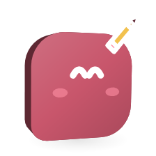

# Viewing and editing files

<picture>
  <source media="(prefers-color-scheme: dark)" srcset="images/orglets/viewing-and-editing-files-dark.png">
  
</picture>

Every file attached to a chat opens in its own viewer. You can read it there, edit a text or code file, mark up a picture, and send the result to the orglet. An edit never changes the file you attached: saving adds a new version to the chat, next to the original.

Part of the [user guide](user-guide.md). How files get into a chat: [Attach files](chat-guide.md#attach-files).

## Open a file

Click a file card in the chat, or open **Details → Sources** and click a row. The viewer shows:

- text and code with line numbers and colours
- Markdown as a document, with **View source text** to see the text
- CSV and TSV as a table, JSON and JSONL as a tree
- images, video and audio
- PDF pages

The buttons at the top right:

- **Ask about this** puts the file on your next message in this chat and closes the viewer, so you can type your question.
- **Edit** (text and code) or **Mark up** (images). The key **E** does the same.
- The arrow opens the file in the program Windows uses for it (images, video, audio and PDF).
- The **i** shows the file's kind, size, where it came from and its hash.
- **⋯ → Revoke read access** stops the orglet reading the file.

## Edit text and code

1. Open a text, code, Markdown, CSV or JSON file.
2. Click **Edit**.
3. Change the text. The editor keeps the file's colours and line numbers.
4. Click **Save**, or press **Ctrl+S**.

The edit is saved as a new file in the same chat: `notes.md` becomes `notes (edited).md`, and editing again gives `notes (edited 2).md`. The viewer then shows the new version, and a message offers **Ask about this**.

Find and replace:

- **Ctrl+F** opens the find bar at the top of the editor, with the selected text already in it.
- **Enter** goes to the next match, **Shift+Enter** to the previous one. The count shows which match you are on.
- The three buttons beside the field match case, match whole words, or treat the text as a regular expression.
- **Replace** changes the current match; **Replace all** changes every match. **Ctrl+Enter** in the replace field replaces all.
- **Esc** closes the find bar.

**Ctrl+Z** undoes and **Ctrl+Shift+Z** redoes. **Tab** indents; to move focus out of the editor with the keyboard, press **Ctrl+M** first, and **Tab** then moves between controls until you press **Ctrl+M** again.

## Mark up an image

1. Open an image.
2. Click **Mark up**.
3. Pick a tool, a colour and a width in the bar under the file name, then draw on the picture.
4. Click **Save**, or click **Ask about this** to save and put it on your next message at once.

| Tool | Key | What it does |
|---|---|---|
| Pen | P | Draws a free line |
| Highlighter | H | A wide, see-through line for marking text |
| Arrow | A | Drag from where the arrow starts to what it points at |
| Rectangle | R | Drag to draw a box |
| Ellipse | O | Drag to draw a circle or oval |
| Text | T | Click where the label goes, type, press **Enter**. **Esc** drops it |
| Crop | C | Drag the part to keep. A click without a drag removes the crop |

- The colours are your theme's red, accent, amber and green, plus black and white.
- The widths are **Thin**, **Medium** and **Thick** (keys **1**, **2**, **3**). The width also sets the size of text labels. Lines and labels are sized to the picture, so they look the same on a small screenshot and a large photo.
- **Ctrl+Z** undoes the last mark or crop and **Ctrl+Shift+Z** redoes it.
- A crop dims what it leaves out until you save, so you can still undo it. The saved picture holds only the part you kept.

A marked-up image is always saved as PNG, at the picture's own size: `screen.jpg` becomes `screen (edited).png`.

## Leaving without saving

If you close the viewer, press **Esc**, or click **Cancel** with changes that are not saved, Orglet asks first: **Discard changes** throws the edit away, **Keep editing** takes you back. The original file is never at risk either way.

## What a saved version is

- It is a file of the chat, listed under **Details → Sources** with its original. The viewer's meta line says which file it was edited from.
- The orglet reads it only when a message carries it: use **Ask about this**, or attach it from the chat's files. Saving alone sends nothing.
- Orglet keeps the edited copy in its own data folder, never next to your file. **Settings → Data → Delete imported sources** and **Erase everything** remove these copies too.
- It counts toward the chat's files like any other.

## What it does not do

- It never writes to the file you attached, or to anything in the chat's working folder. To change a file in the working folder, ask the orglet: its changes wait for you to review before they reach the folder ([Review before the folder changes](chat-guide.md#review-before-the-folder-changes)). To change the file yourself, open it in its own program with the arrow button.
- Video, audio and Parquet files can be viewed but not edited. PDF pages can be viewed but not edited yet.
- A revoked file, or one too large to show, cannot be edited.
